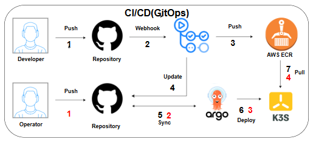

## 도커로 띄우고 테스트 해보기 가이드

### 0단계 : 해당 브랜치 아래에 새로운 브랜치를 생성

### 1단계 : MySQL 데이터베이스 준비하기

MySQL은 내부 로컬 컴퓨터에 있는 MySQL로 연결을 진행합니다.

전체적인 테스트를 위해서는 모든 모듈이 필요로 하는 DATABASE가 우선 생성되어 있어야 합니다.

아래의 쿼리를 복사 붙여넣기 해서 WORKBENCH 등에서 미리 실행해 주세요!

기존 DB가 있는 경우 생략되고 없는 경우에만 생성되게 되어 있으니 기존 DB가 지워지거나 덮어쓰이지 않습니다

```angular2html
-- ✅ Baro-Farm 각 서비스 DB 생성
-- 이미 있으면 건너뛰도록 IF NOT EXISTS 사용

CREATE DATABASE IF NOT EXISTS baroauth
  DEFAULT CHARACTER SET utf8mb4
  DEFAULT COLLATE utf8mb4_unicode_ci;

CREATE DATABASE IF NOT EXISTS barobuyer
  DEFAULT CHARACTER SET utf8mb4
  DEFAULT COLLATE utf8mb4_unicode_ci;

CREATE DATABASE IF NOT EXISTS baroorder
  DEFAULT CHARACTER SET utf8mb4
  DEFAULT COLLATE utf8mb4_unicode_ci;

CREATE DATABASE IF NOT EXISTS baropayment
  DEFAULT CHARACTER SET utf8mb4
  DEFAULT COLLATE utf8mb4_unicode_ci;

CREATE DATABASE IF NOT EXISTS baroseller
  DEFAULT CHARACTER SET utf8mb4
  DEFAULT COLLATE utf8mb4_unicode_ci;

CREATE DATABASE IF NOT EXISTS barosupport
  DEFAULT CHARACTER SET utf8mb4
  DEFAULT COLLATE utf8mb4_unicode_ci;

CREATE DATABASE IF NOT EXISTS barosettlement
  DEFAULT CHARACTER SET utf8mb4
```
 
### 2단계: MYSQL 유저 정보 입력하기

>제가 DM으로 새롭게 드린 .env.docker 에 아래 항목이 비워져 있을거에요. 이 부분을 본인 로컬 MySQL 정보로 넣어주세요!

MYSQL_USER=

MYSQL_PASSWORD=

### 3단계: S3 마운트 경로 이슈

> 이 부분은 MAC의 경우에 문제가 빈발하는 지점입니다.
아쉽게도 제가 직접 MAC으로 테스트를 진행해보진 못해서요.
이 부분 진행하다 안되시면 다시 dm 주시기 바랍니다..!

일단 제가 찾은 방법은 아래와 같습니다. 

원래 S3를 마운트하고 거기로 들어갈 로그 파일들이 있어서 해당 경로값이 docker-compose 설정값에 있습니다.

하지만 S3 마운트가 로컬에선 불가능하므로 다음과 같이 폴더명을 넣어 대체합니다.

아래와 같이 경로에 baro-s3폴더를 만들고 .env.docker에 다음과 같이 입력합니다.

```angular2html
# OS별 S3 마운트 경로
# Windows: /c/Users/<name>/baro-s3
# macOS:   /Users/<name>/baro-s3

예) S3_MOUNT_PATH=C:\Users\mm206\baro-s3
```

### 추가: ai 서비스 관련
> ai의 경우에 seasonality라는게 주입되고 사용이 됩니다. false로 사용을 안하려고 해도
> 에러가 났기 때문에 해당 경로에 더미형태의 seasonality-data.csv를 하나 만들어줘야 합니다.

아래의 코드를 맥에 입력하면 해당 경로에 csv파일이 생성되고 폴더도 생성됩니다.
다만, name은 해당 사용자 명을 적어야 합니다.

```angular2html
mkdir -p /Users/<name>/baro-s3/dataset/season
  printf "productName,category,content,seasonalityType,seasonalityValue,sourceType\n" > /Users/<name>/baro-s3/dataset/season/seasonality-data.csv
```

### 3단계 : 도커 빌드 하고 올리기 

### 맥용
```angular2html
docker compose -p beadv2_2_dogs_be \
  -f docker-compose.data.yml \
  -f docker-compose.kafka.yml \
  -f docker-compose.elasticsearch.yml \
  -f docker-compose.cloud.yml \
  -f docker-compose.auth.yml \
  -f docker-compose.buyer.yml \
  -f docker-compose.seller.yml \
  -f docker-compose.order.yml \
  -f docker-compose.payment.yml \
  -f docker-compose.support.yml \
  -f docker-compose.ai.yml \
  -f docker-compose.test.baro-settlement.yml \
  -f docker-compose.override.local.auth.yml \
  -f docker-compose.override.local.buyer.yml \
  -f docker-compose.override.local.seller.yml \
  -f docker-compose.override.local.order.yml \
  -f docker-compose.override.local.payment.yml \
  -f docker-compose.override.local.support.yml \
  -f docker-compose.override.local.ai.yml \
  -f docker-compose.override.local.cloud.yml \
  -f docker-compose.override.local.rds.yml \
  --env-file .env.docker \
  up -d --build

```

### 윈도우용
```angular2html
docker compose -p beadv2_2_dogs_be `
    -f docker-compose.data.yml `
    -f docker-compose.kafka.yml `
    -f docker-compose.elasticsearch.yml `
    -f docker-compose.cloud.yml `
    -f docker-compose.auth.yml `
    -f docker-compose.buyer.yml `
    -f docker-compose.seller.yml `
    -f docker-compose.order.yml `
    -f docker-compose.payment.yml `
    -f docker-compose.support.yml `
    -f docker-compose.ai.yml `
    -f docker-compose.test.baro-settlement.yml `
    -f docker-compose.override.local.auth.yml `
    -f docker-compose.override.local.buyer.yml `
    -f docker-compose.override.local.seller.yml `
    -f docker-compose.override.local.order.yml `
    -f docker-compose.override.local.payment.yml `
    -f docker-compose.override.local.support.yml `
    -f docker-compose.override.local.ai.yml `
    -f docker-compose.override.local.cloud.yml `
    -f docker-compose.override.local.rds.yml `
    --env-file .env.docker `
    up -d --build

```

### 4단계 : --build 제거

이후에 src내부 코드가 아니라 docker-compose만 변경되는 경우 build를 다 할필요가 없으므로
마지막에 붙어있는 `--build`를 제거하시고 재실행 하시면 됩니다.


### 맥용
```angular2html
docker compose -p beadv2_2_dogs_be \
  -f docker-compose.data.yml \
  -f docker-compose.kafka.yml \
  -f docker-compose.elasticsearch.yml \
  -f docker-compose.cloud.yml \
  -f docker-compose.auth.yml \
  -f docker-compose.buyer.yml \
  -f docker-compose.seller.yml \
  -f docker-compose.order.yml \
  -f docker-compose.payment.yml \
  -f docker-compose.support.yml \
  -f docker-compose.ai.yml \
  -f docker-compose.test.baro-settlement.yml \
  -f docker-compose.override.local.auth.yml \
  -f docker-compose.override.local.buyer.yml \
  -f docker-compose.override.local.seller.yml \
  -f docker-compose.override.local.order.yml \
  -f docker-compose.override.local.payment.yml \
  -f docker-compose.override.local.support.yml \
  -f docker-compose.override.local.ai.yml \
  -f docker-compose.override.local.cloud.yml \
  -f docker-compose.override.local.rds.yml \
  --env-file .env.docker \
  up -d 

```

### 윈도우용
```angular2html
docker compose -p beadv2_2_dogs_be `
    -f docker-compose.data.yml `
    -f docker-compose.kafka.yml `
    -f docker-compose.elasticsearch.yml `
    -f docker-compose.cloud.yml `
    -f docker-compose.auth.yml `
    -f docker-compose.buyer.yml `
    -f docker-compose.seller.yml `
    -f docker-compose.order.yml `
    -f docker-compose.payment.yml `
    -f docker-compose.support.yml `
    -f docker-compose.ai.yml `
    -f docker-compose.test.baro-settlement.yml `
    -f docker-compose.override.local.auth.yml `
    -f docker-compose.override.local.buyer.yml `
    -f docker-compose.override.local.seller.yml `
    -f docker-compose.override.local.order.yml `
    -f docker-compose.override.local.payment.yml `
    -f docker-compose.override.local.support.yml `
    -f docker-compose.override.local.ai.yml `
    -f docker-compose.override.local.cloud.yml `
    -f docker-compose.override.local.rds.yml `
    --env-file .env.docker `
    up -d 

```

### 5단계 : 프론트는 main기준으로 활용해주시면 됩니다.
 프론트의 경우에는 위와 같이 .env.local을 가장 바깥쪽에 하나 만들어주시고
제가 드리는 설정값을 넣으셔서 최신 main기준으로 실행하시면 됩니다.

다만 실행하실 때, 로컬의 경우는 

```angular2html
pnpm dev --port 3001
```
로 실행해주세요. 

포트번호 3001에 맞춰 로컬 테스트를 하면서 3000의 경우 에러가 날수도 있어서 입니다.
