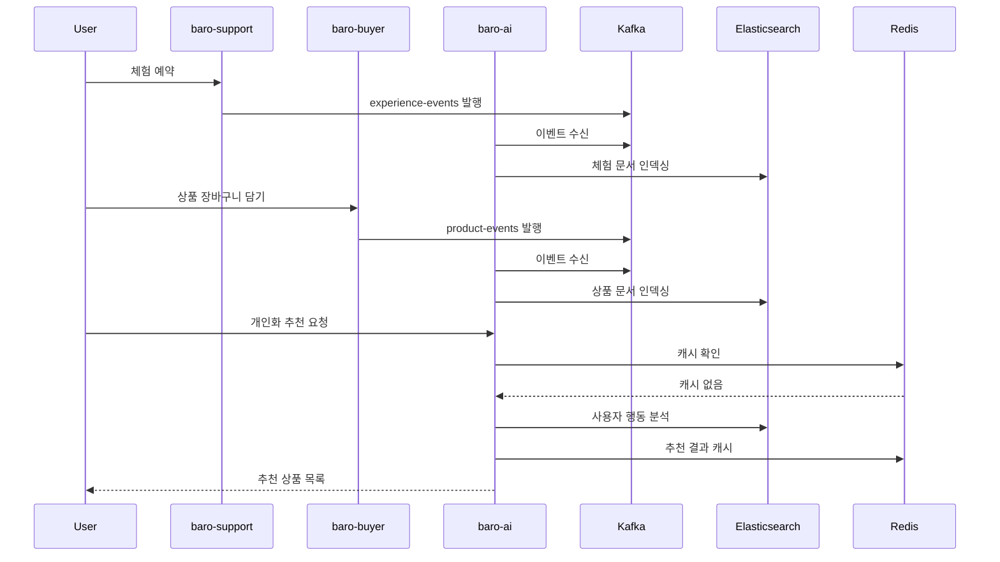

# 시스템 아키텍처

## 🏛️ 전체 아키텍처

```
┌─────────────────────────────────────────────────┐
│                Frontend/Buyer                   │
└─────────────────┬───────────────────────────────┘
                  │
┌─────────────────┼───────────────────────────────┐
│            API Gateway (Spring Cloud)           │
└─────────────────┼───────────────────────────────┘
                  │
    ┌─────────────┼─────────────┐
    │             │             │
┌───▼────┐   ┌────▼────┐   ┌────▼────┐
│ baro-  │   │ baro-   │   │ baro-   │
│ support│   │ buyer   │   │ ai      │
│        │   │         │   │         │
│ - 체험  │   │ - 상품  │   │ - 추천  │
│ - 예약  │   │ - 장바구니│   │ - 검색  │
│ - 주문  │   │ - 주문   │   │ - 챗봇   │
└───┬────┘   └────┬────┘   └────┬────┘
    │             │             │
    └─────────────┼─────────────┼─────────────┐
                  │             │             │
           ┌──────▼─────┐ ┌─────▼─────┐ ┌─────▼─────┐
           │   Kafka    │ │ Elasticsearch│ │   Redis    │
           │   Events   │ │   Vector     │ │   Cache     │
           └────────────┘ └─────────────┘ └─────────────┘
```

## 📦 모듈 상세 구조

### baro-ai 모듈 패키지 구조

```
com.barofarm.ai/
├── common/
│   ├── config/                 # Swagger, 공통 설정
│   ├── entity/                 # BaseEntity 등 공통 JPA 베이스
│   ├── exception/              # 공통 예외
│   └── response/               # 공통 Response/CustomPage

├── config/                     # 인프라/외부 시스템 설정
│   ├── KafkaConsumerConfig.java
│   ├── ElasticsearchConfig.java
│   ├── OpenAiConfig.java
│   └── JpaConfig.java

├── event/                      # Kafka 이벤트 수신 계층 (입력 포트)
│   ├── model/                  # Product/Cart/Order/Search/Experience 이벤트 payload
│   └── consumer/               # @KafkaListener들 (log/embedding 레이어로 전달)

├── log/                        # 사용자 행동 로그 (RDB, 개인화의 raw 데이터)
│   ├── domain/                 # SearchLog, CartEventLog, OrderEventLog, UserEventLog
│   ├── repository/             # 각 로그용 JPA Repository
│   ├── application/            # LogWriteService, LogReadService
│   └── dto/                    # 필요 시 외부 노출용 DTO

├── embedding/                  # 벡터/임베딩 관리 (User Profile, Product, Experience, Policy)
│   ├── model/                  # UserProfileEmbeddingDocument, ProductEmbeddingDocument 등 (ES 문서)
│   ├── service/
│   │   ├── UserProfileEmbeddingService.java   # userId 기준 취향 벡터 생성
│   │   ├── ProductEmbeddingService.java       # 상품 임베딩
│   │   ├── ExperienceEmbeddingService.java    # 체험 임베딩
│   │   └── PolicyEmbeddingInitService.java    # RAG용 정책 임베딩
│   └── scheduler/
│       └── EmbeddingBatchJob.java             # 배치/스케줄 (필요 시)

├── search/                     # (AI 관점의) 검색 뷰 - 기존 ES 검색 + 자동완성
│   ├── domain/                 # ProductDocument, ExperienceDocument 등 ES 문서
│   ├── infrastructure/
│   │   ├── elasticsearch/      # ES Repository (상품/체험 검색/자동완성)
│   │   └── event/              # ProductEvent, ExperienceEvent Consumer (ES 인덱싱용)
│   ├── application/            # ProductSearchService, ExperienceSearchService, UnifiedSearchService
│   ├── presentation/           # 검색/자동완성 API (상품/체험/통합)
│   └── util/                   # KoreanChosungUtil 등 검색 유틸

├── recommend/                  # 추천 도메인 (개인화/레시피/유사 상품)
│   ├── model/
│   │   ├── PersonalizedRecommendation.java   # 개인화 추천 결과 객체
│   │   ├── RecipeRecommendation.java         # 레시피 추천 결과
│   │   └── SimilarProductResult.java         # 유사 상품 추천 결과
│   ├── service/
│   │   ├── PersonalizedRecommendService.java # userId 기반 개인화 추천
│   │   ├── RecipeRecommendService.java       # 장바구니 & 입력 재료 기반 레시피 추천
│   │   └── SimilarProductService.java        # 특정 상품 기준 유사 상품 추천
│   └── facade/
│       └── RecommendationFacade.java         # Controller에서 호출하는 진입점

├── presentation/               # 외부로 노출되는 API (REST)
│   ├── RecommendationController.java  # /api/v1/recommendations/**
│   └── ChatbotController.java         # /api/v1/chatbot/**

└── AiApplication.java
```

## 🔄 각 레이어 역할 및 상호작용

### 2.1 `common/` – 공통 기술 유틸 계층

**역할**
- Swagger 설정, 공통 Exception/Response, BaseEntity 등 **기술 공유 레이어**
- 비즈니스와 무관한, 모든 기능이 같이 쓰는 것들

**상호작용**
- `presentation`, `search`, `recommend`, `log` 등 **모든 패키지에서 import**
- 도메인 흐름을 주도하지 않고, **단지 편의/표준 포맷 제공**

### 2.2 `config/` – 인프라 연결 계층

**역할**
- Kafka, Elasticsearch, JPA, OpenAI/Spring AI 설정
- "외부 세계와의 연결선"을 정의

**파일 역할 예**
- `KafkaConsumerConfig`: `@KafkaListener`용 `ConcurrentKafkaListenerContainerFactory` 제공
- `ElasticsearchConfig`: ES 클라이언트, VectorStore 설정
- `OpenAiConfig`: Spring AI의 `ChatModel`, `EmbeddingModel` Bean 정의
- `JpaConfig`: JPA/Auditing 활성화

### 2.3 `event/` – Kafka 이벤트 입구

**역할**
- `ProductEvent`, `CartEvent`, `OrderEvent`, `SearchEvent`, `ExperienceEvent` 등 **Kafka로부터 받는 메시지의 스키마** 정의
- `@KafkaListener`들로 **내부 도메인 계층으로 전달하는 어댑터**

**상호작용 흐름**
1. Kafka에서 메시지 수신 → `event.consumer.*` 호출
2. 내부에서 `LogWriteService` 호출 → DB 로그 적재
3. 필요 시 `UserProfileEmbeddingService`나 다른 서비스 트리거

### 2.4 `log/` – 행동 로그 저장소 (RDB, 개인화의 raw 데이터)

**역할**
- `CartEventLog`, `OrderEventLog`, `SearchLog`, `UserEventLog` 등 **유저 행동을 시간 순으로 저장**
- userId를 기준으로 조회 가능한 **쿼리/집계의 기반**

**흐름 예**
- `CartEventConsumer` → `CartEvent` 수신 → `LogWriteService.saveCartEvent()` → `CartEventLog` 테이블 저장
- 추천 시 `LogReadService.getRecentLogs(userId)`로 행동 히스토리 조회

### 2.5 `embedding/` – 벡터/임베딩 계층

**역할**
- ES에 저장할 벡터 문서 정의: `UserProfileEmbeddingDocument`, `ProductEmbeddingDocument` 등
- 로그/도메인 이벤트 → 벡터 표현으로 변환

**서비스 예**
- `UserProfileEmbeddingService`: 로그 텍스트 → Embedding → ES `user-profile-embeddings` 저장
- `ProductEmbeddingService`: 상품 이벤트 → 상품 벡터 생성
- `PolicyEmbeddingInitService`: 정책 문서 → RAG용 벡터

### 2.6 `search/` – AI 관점 검색 뷰

**역할**
- ES 기반 상품/체험 검색 + 자동완성 (키워드 + 초성 + 오탈자 허용)
- 추천/레시피에서 **부족 재료 매핑**이나 **상품 후보 조회** 시 내부 클라이언트로 사용

**흐름 예**
- 상품 생성 → `product-events` → `ProductEventConsumer` → ES `product` 인덱스 저장
- 프론트 검색 요청 → `ProductSearchController` → `ProductSearchService.searchOnlyProducts()` → ES 조회

### 2.7 `recommend/` – 추천 도메인 (핵심)

**역할**
- 개인화/레시피/유사 상품 추천의 **핵심 로직**
- `LogReadService` + `UserProfileEmbeddingService` + 상품 벡터 등 활용

**주요 서비스**
- `PersonalizedRecommendService`: userId 기반 취향 분석 → 상품 랭킹
- `RecipeRecommendService`: 장바구니 재료 → LLM 레시피 생성 → 부족 재료 검색
- `RecommendationFacade`: Controller의 단일 진입점

### 2.8 `presentation/` – 외부 진입점 (REST)

**역할**
- `/api/v1/recommendations/**`, `/api/v1/chatbot/**` 등 **외부로 노출되는 API**
- 비즈니스 로직은 모두 `RecommendationFacade` / `recommend.service.*` 에 위임

## 🔄 데이터 흐름

### 1. 이벤트 기반 데이터 수집



### 2. 실시간 추천 처리

```java
// 추천 요청 처리 플로우
@RestController
public class RecommendationController {

    @GetMapping("/personalized/{userId}")
    public ResponseDto<List<Long>> getPersonalizedRecommendations(
            @PathVariable Long userId) {

        // 1. Redis 캐시 확인
        String cacheKey = "recommend:user:" + userId;
        List<Long> cached = redisTemplate.opsForList().range(cacheKey, 0, -1);

        if (!cached.isEmpty()) {
            return ResponseDto.ok(cached.stream()
                .map(Long::valueOf)
                .collect(Collectors.toList()));
        }

        // 2. 실시간 계산
        List<Long> recommendations = recommendationService
            .generatePersonalizedRecommendations(userId);

        // 3. 캐시 저장 (1시간 TTL)
        redisTemplate.opsForList().rightPushAll(cacheKey, recommendations);
        redisTemplate.expire(cacheKey, 1, TimeUnit.HOURS);

        return ResponseDto.ok(recommendations);
    }
}
```

## 🏭 기술 컴포넌트

### 이벤트 처리 (Kafka)

```yaml
# application.yml
spring:
  kafka:
    consumer:
      group-id: ai-service
      properties:
        spring.json.trusted.packages: "*"
        spring.json.type.mapping:
          experienceEvent: com.barofarm.ai.search.infrastructure.event.ExperienceEvent
          productEvent: com.barofarm.ai.search.infrastructure.event.ProductEvent
    producer:
      key-serializer: org.apache.kafka.common.serialization.StringSerializer
      value-serializer: org.springframework.kafka.support.serializer.JsonSerializer
```

### 벡터 저장소 (Elasticsearch)

```yaml
# application.yml
spring:
  elasticsearch:
    uris: http://elasticsearch:9200

# 인덱스 매핑 예시
PUT /experience
{
  "mappings": {
    "properties": {
      "experienceId": { "type": "keyword" },
      "experienceName": {
        "type": "text",
        "analyzer": "nori",
        "fields": {
          "chosung": { "type": "keyword" }
        }
      },
      "embedding": {
        "type": "dense_vector",
        "dims": 1536
      }
    }
  }
}
```

### 캐시 전략 (Redis)

```yaml
# application.yml
spring:
  data:
    redis:
      host: redis
      port: 6379

# 캐시 키 전략
recommend:user:{userId}        # 개인화 추천 결과
search:popular                 # 인기 검색어
chat:session:{sessionId}       # 챗봇 세션
```

## 🔐 보안 및 모니터링

### API 보안
- **JWT 토큰 검증**: 사용자 인증
- **Rate Limiting**: API 호출 제한
- **Circuit Breaker**: 외부 서비스 장애 대응

### 모니터링
- **메트릭 수집**: 응답 시간, 성공률, 비용
- **로그 수집**: 사용자 행동, 에러 추적
- **알림**: 예산 초과, 성능 저하 감지

## 🚀 확장성 고려사항

### 수평 확장
- **Stateless 디자인**: 세션 없는 아키텍처
- **데이터 파티셔닝**: 사용자별 데이터 분산
- **캐시 클러스터링**: Redis 클러스터 구성

### 비용 최적화
- **모델 선택**: 무료 ↔ 유료 모델 자동 전환
- **캐시 활용**: 반복 요청 캐시
- **배치 처리**: 실시간 → 배치 전환 가능

### 장애 대응
- **Graceful Degradation**: AI 실패 시 기본 로직
- **Fallback 전략**: 다중 모델 지원
- **Circuit Breaker**: 연쇄 장애 방지
