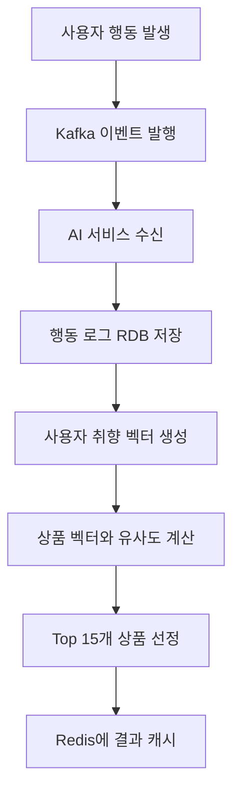
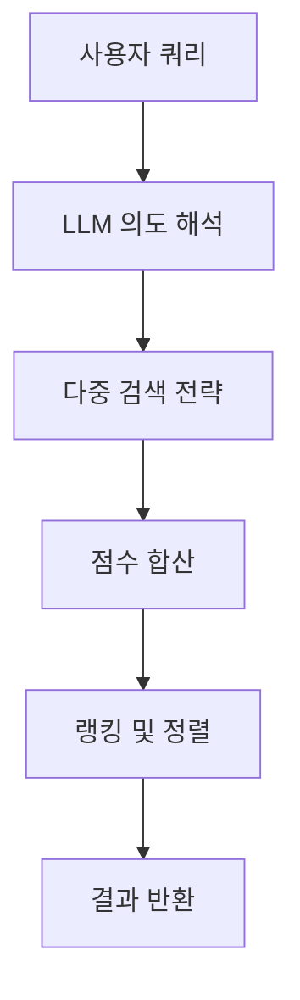

# AI 기능 상세 설명

## 🎯 1. **로그 기반 개인화 추천** (핵심 기능)

**관여 패키지**: `event.consumer`, `log.*`, `embedding.service`, `recommend.service`, `presentation`

### 기능 개요
사용자의 **장바구니, 검색, 주문 내역**을 분석하여 개인 취향을 학습하고 맞춤 상품을 추천합니다.

### 데이터 소스
- **장바구니(cart)**: 현재 담긴 상품
- **검색 로그(search)**: 검색한 키워드와 상품
- **주문 내역(order)**: 실제 구매한 상품

### 추천 순서



### API 흐름

```java
// 1. 페이지 로드 시 호출
GET /api/v1/recommendations/personalized/{userId}

// 2. Redis 캐시 확인
if (redis.hasKey(userId)) {
    return redis.get(userId); // 캐시된 추천 상품 ID 리스트
}

// 3. 캐시 미스 시 실시간 계산
List<Long> recommendedProductIds = recommendationService
    .generatePersonalizedRecommendations(userId);

// 4. 결과 캐시 후 반환
redis.set(userId, recommendedProductIds, TTL_1HOUR);
return recommendedProductIds;
```

### 기술 구현
- **벡터 생성**: 사용자 행동 패턴 → 임베딩 모델 → 취향 벡터
- **유사도 계산**: 코사인 유사도로 상품 벡터 매칭
- **랭킹**: 유사도 점수 기반 Top-K 추출
- **캐싱**: Redis로 실시간 응답 보장

---

## 👩‍🍳 2. **레시피 추천** (핵심 기능)

**관여 패키지**: `log.application`, `embedding.service`, `recommend.service`, `search.application`, `presentation`

### 기능 개요
사용자의 장바구니 상품을 분석하여 **가능한 레시피를 추천**하고, 부족한 재료를 찾아 상품으로 제안합니다.

### 추천 예시

```text
사용자 장바구니: 애호박, 두부, 계란

AI 분석 결과:
🎯 "된장찌개" 레시피 추천!

필요 재료:
✅ 애호박 (장바구니에 있음)
✅ 두부 (장바구니에 있음)
✅ 계란 (장바구니에 있음)
❌ 된장 (부족 - 상품 추천)

추천 상품: "국산 된장 500g" - 바로팜에서 구매 가능!
```

### 구현 로직

```java
public RecipeRecommendation suggestRecipe(List<CartItem> cartItems) {
    // 1. 장바구니 상품 목록 추출
    List<String> ingredients = cartItems.stream()
        .map(CartItem::getProductName)
        .collect(Collectors.toList());

    // 2. LLM으로 레시피 분석
    String prompt = buildRecipePrompt(ingredients);
    String llmResponse = chatModel.call(prompt);

    // 3. 부족 재료 추출
    List<String> missingIngredients = parseMissingIngredients(llmResponse);

    // 4. Elasticsearch로 상품 검색
    List<Product> recommendedProducts = missingIngredients.stream()
        .map(ingredient -> elasticsearchService.searchProducts(ingredient, 3))
        .flatMap(List::stream)
        .collect(Collectors.toList());

    return new RecipeRecommendation(llmResponse, recommendedProducts);
}
```

### 기술 구현
- **LLM 분석**: 상품 조합 → 레시피 추론
- **재료 매핑**: 한글 재료명 → 표준화된 검색어
- **상품 검색**: Elasticsearch로 재료 관련 상품 조회
- **실시간 재고**: 상품 추천 시 재고 상태 확인

---

## 💬 3. **서비스 챗봇** (보조 기능)

**관여 패키지**: `embedding.service`, `presentation`

### 기능 개요
서비스 정책과 관련된 질문을 **정확하게 답변**하는 AI 챗봇입니다.

### 지원 질문 유형

```text
✅ 지원 가능:
- "상품을 주문했는데 환불하고 싶어요. 언제까지 가능하나요?"
- "배송비는 얼마인가요? 무료 배송 조건이 있나요?"
- "농산물 신선도 보장은 어떻게 되나요?"

❌ 지원 불가:
- 상품 추천, 레시피 문의 (다른 기능에서 처리)
- 개인 계정 정보, 주문 상태 (권한 이슈)
```

### RAG 구현

```java
@Service
public class PolicyChatbotService {

    @Autowired
    private VectorStore vectorStore; // 정책 문서 벡터

    @Autowired
    private ChatModel chatModel; // GPT-4 with RAG

    public String answerQuestion(String question) {
        // 1. 질문과 유사한 정책 문서 검색
        List<Document> relevantPolicies = vectorStore
            .similaritySearch(question, 3);

        // 2. 검색된 정책을 컨텍스트로 답변 생성
        String context = relevantPolicies.stream()
            .map(Document::getContent)
            .collect(Collectors.joining("\n"));

        String prompt = String.format("""
            다음은 바로팜 서비스 정책입니다:

            %s

            위 정책을 바탕으로 다음 질문에 답변해주세요:
            %s

            답변은 친절하고 정확해야 합니다.
            """, context, question);

        return chatModel.call(prompt);
    }
}
```

### 기술 구현
- **문서 임베딩**: 서비스 정책 문서 → 벡터 변환
- **유사도 검색**: 질문 → 관련 정책 문서 검색
- **컨텍스트 답변**: 검색된 정책 기반 정확한 답변 생성
- **안전성**: 정책 외 질문은 적절히 거부

---

## 🔍 4. **의미 검색** (보조 기능)

**관여 패키지**: `search.*`, `presentation`

### 기능 개요
단순 키워드 검색이 아닌 **사용자의 의도를 이해**하여 정확한 검색 결과를 제공합니다.

### 검색 파이프라인



### 검색 전략

```java
public SearchResult hybridSearch(String query) {
    // 1. LLM으로 의도 파악
    String intent = llmIntentAnalyzer.analyzeIntent(query);

    // 2. 다중 검색 실행
    CompletableFuture<List<Product>> exactResults = elasticsearchService.exactMatch(query);
    CompletableFuture<List<Product>> fuzzyResults = elasticsearchService.fuzzyMatch(query);
    CompletableFuture<List<Product>> vectorResults = vectorStore.similaritySearch(query);

    // 3. 점수 가중치 적용
    List<ScoredProduct> allResults = Stream.of(exactResults, fuzzyResults, vectorResults)
        .map(CompletableFuture::join)
        .flatMap(List::stream)
        .map(product -> scoreProduct(product, intent))
        .sorted(Comparator.comparing(ScoredProduct::getScore).reversed())
        .limit(50)
        .collect(Collectors.toList());

    return new SearchResult(allResults);
}
```

### 점수 가중치

| 검색 유형 | 가중치 | 설명 |
|----------|--------|------|
| **정확 일치** | 3.0 | 쿼리와 완전히 일치하는 상품 |
| **부분 일치** | 2.0 | 쿼리를 포함하는 상품 |
| **벡터 유사도** | 1.0-2.0 | 의미적으로 유사한 상품 |
| **오탈자 허용** | 0.5 | Fuzzy 매칭된 상품 |

### 기술 구현
- **의도 해석**: LLM으로 검색 의도 파악
- **하이브리드 검색**: 키워드 + 벡터 검색 결합
- **점수 정규화**: 각 검색 결과의 점수 표준화
- **랭킹 최적화**: 다중 요소 기반 최종 순위 결정
