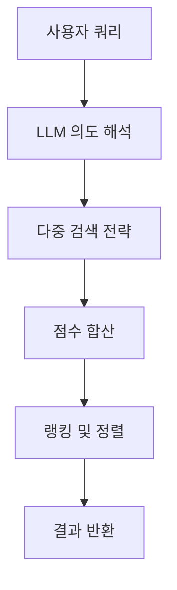

# 🎯 기능 명세 및 API 설계

> baro-ai 모듈이 제공하는 기능들의 상세 명세와 API 인터페이스

## 📋 목차

- [개인화 추천 API](#-개인화-추천-api)
- [레시피 추천 API](#-레시피-추천-api)
- [상품 검색 API](#-상품-검색-api)
- [체험 검색 API](#-체험-검색-api)
- [통합 검색 API](#-통합-검색-api)
- [챗봇 API](#-챗봇-api)

---

## 🛒 개인화 추천 API

사용자의 행동 로그를 기반으로 개인화된 상품을 추천합니다.

### GET /api/v1/recommendations/personalized/{userId}

사용자의 개인화 추천 상품 목록을 조회합니다.

#### 요청 파라미터
```json
{
  "userId": "number (필수) - 사용자 ID"
}
```

#### 응답 형식
```json
{
  "success": true,
  "data": [1001, 1002, 1003, 1004, 1005],
  "message": "개인화 추천 상품 조회 성공"
}
```

#### 응답 필드 설명
- `data`: 추천 상품 ID 배열 (최대 15개)
- 추천 순서는 유사도 점수 기반 내림차순

#### 캐싱 전략
- Redis TTL: 1시간
- 키 형식: `recommend:user:{userId}`

#### 에러 응답
```json
{
  "success": false,
  "error": {
    "code": "USER_NOT_FOUND",
    "message": "사용자를 찾을 수 없습니다"
  }
}
```

---

## 👩‍🍳 레시피 추천 API

장바구니 상품을 기반으로 레시피를 추천하고 부족 재료를 제안합니다.

### POST /api/v1/recommendations/recipes/from-cart

장바구니 상품을 분석하여 레시피를 추천합니다.

#### 요청 본문
```json
{
  "userId": 123
}
```

#### 응답 형식
```json
{
  "success": true,
  "data": {
    "recipeName": "된장찌개",
    "ingredients": [
      {"name": "애호박", "available": true},
      {"name": "두부", "available": true},
      {"name": "된장", "available": false}
    ],
    "instructions": "1. 재료를 썰어 물에 넣고 끓인다...",
    "missingIngredients": [
      {
        "name": "된장",
        "recommendedProducts": [
          {
            "productId": 2001,
            "productName": "국산 된장 500g",
            "price": 8500
          }
        ]
      }
    ]
  }
}
```

#### 요청 방식별 엔드포인트

**장바구니 기반**: `POST /api/v1/recommendations/recipes/from-cart`
**직접 입력**: `POST /api/v1/recommendations/recipes/from-ingredients`

```json
{
  "ingredients": ["애호박", "두부", "계란"],
  "preferences": "매운 음식"
}
```

---

## 🔍 상품 검색 API

의미 기반 상품 검색 및 자동완성을 제공합니다.

### GET /api/v1/search/products

상품을 키워드로 검색합니다.

#### 쿼리 파라미터
```text
GET /api/v1/search/products?q=사과&category=과일&page=0&size=20
```

#### 요청 파라미터
- `q`: 검색 키워드 (필수)
- `category`: 카테고리 필터 (선택)
- `minPrice`: 최소 가격 (선택)
- `maxPrice`: 최대 가격 (선택)
- `page`: 페이지 번호 (기본값: 0)
- `size`: 페이지 크기 (기본값: 20)

#### 응답 형식
```json
{
  "success": true,
  "data": {
    "content": [
      {
        "productId": 1001,
        "productName": "GAP 인증 사과 1kg",
        "category": "과일",
        "price": 12000,
        "score": 0.95
      }
    ],
    "pageable": {
      "pageNumber": 0,
      "pageSize": 20
    },
    "totalElements": 45
  }
}
```

### GET /api/v1/search/products/autocomplete

상품명 자동완성 제안 목록을 조회합니다.

#### 쿼리 파라미터
```text
GET /api/v1/search/products/autocomplete?q=사과&limit=10
```

#### 응답 형식
```json
{
  "success": true,
  "data": [
    "사과",
    "사과즙",
    "사과차",
    "사과잼"
  ]
}
```

---

## 🎪 체험 검색 API

체험 상품 검색 및 자동완성을 제공합니다.

### GET /api/v1/search/experiences

체험 상품을 검색합니다.

#### 쿼리 파라미터
```text
GET /api/v1/search/experiences?q=농장체험&region=경기도&page=0&size=10
```

#### 요청 파라미터
- `q`: 검색 키워드 (필수)
- `region`: 지역 필터 (선택)
- `minPrice`: 최소 가격 (선택)
- `maxPrice`: 최대 가격 (선택)
- `startDate`: 시작 날짜 (선택)
- `endDate`: 종료 날짜 (선택)

#### 응답 형식
```json
{
  "success": true,
  "data": {
    "content": [
      {
        "experienceId": 3001,
        "experienceName": "전통 농장 체험",
        "region": "경기도 가평",
        "pricePerPerson": 35000,
        "capacity": 20,
        "durationMinutes": 180
      }
    ],
    "pageable": {
      "pageNumber": 0,
      "pageSize": 10
    }
  }
}
```

### GET /api/v1/search/experiences/autocomplete

체험명 자동완성 제안 목록을 조회합니다.

---

## 🔎 통합 검색 API

상품과 체험을 동시에 검색합니다.

### GET /api/v1/search/unified

통합 검색 결과를 조회합니다.

#### 쿼리 파라미터
```text
GET /api/v1/search/unified?q=사과&page=0&size=20
```

#### 응답 형식
```json
{
  "success": true,
  "data": {
    "products": {
      "content": [...],
      "totalElements": 25
    },
    "experiences": {
      "content": [...],
      "totalElements": 5
    }
  }
}
```

---

## 💬 챗봇 API

서비스 정책 관련 질문을 답변하는 AI 챗봇입니다.

### POST /api/v1/chatbot/ask

질문을 입력받아 정책 기반 답변을 제공합니다.

#### 요청 본문
```json
{
  "question": "환불은 언제까지 가능한가요?",
  "sessionId": "session-123" // 선택적
}
```

#### 응답 형식
```json
{
  "success": true,
  "data": {
    "answer": "상품 수령 후 7일 이내에 환불 가능합니다...",
    "confidence": 0.92,
    "sources": [
      {
        "policy": "환불 정책",
        "relevance": 0.95
      }
    ]
  }
}
```

#### 지원 질문 유형

✅ **지원 가능**
- 상품 주문/배송/환불 정책
- 서비스 이용 방법
- 농산물 품질 보장

❌ **지원 불가**
- 상품 추천 문의
- 개인 계정 정보
- 기술 지원

---

## 🔄 공통 응답 형식

모든 API는 일관된 응답 형식을 따릅니다.

### 성공 응답
```json
{
  "success": true,
  "data": { ... },
  "message": "요청 처리 성공"
}
```

### 에러 응답
```json
{
  "success": false,
  "error": {
    "code": "VALIDATION_ERROR",
    "message": "입력 값이 올바르지 않습니다",
    "details": { ... }
  }
}
```

### 공통 에러 코드
- `VALIDATION_ERROR`: 입력 값 검증 실패
- `USER_NOT_FOUND`: 사용자 정보 없음
- `SERVICE_UNAVAILABLE`: 외부 서비스 장애
- `RATE_LIMIT_EXCEEDED`: 요청 제한 초과

---

## 📊 API 성능 메트릭

### 응답 시간 SLA
- 개인화 추천: 200ms 이하 (캐시 히트 시)
- 검색: 300ms 이하
- 챗봇: 2초 이하

### 캐시 전략
- 개인화 추천: Redis TTL 1시간
- 검색 결과: Redis TTL 10분
- 자동완성: Redis TTL 1시간

### Rate Limiting
- IP당 분당 100회 요청
- 사용자당 분당 50회 추천 요청

---

*이 문서는 API 인터페이스 명세를 중심으로 작성되었습니다. 구현 세부사항은 [구현 가이드](IMPLEMENTATION.md)를 참고해주세요.*

### 기술 구현
- **벡터 생성**: 사용자 행동 패턴 → 임베딩 모델 → 취향 벡터
- **유사도 계산**: 코사인 유사도로 상품 벡터 매칭
- **랭킹**: 유사도 점수 기반 Top-K 추출
- **캐싱**: Redis로 실시간 응답 보장

---

## 👩‍🍳 2. **레시피 추천** (핵심 기능)

**관여 계층**: `domain`, `application`, `infrastructure`

### 기능 개요
사용자의 장바구니 상품을 분석하여 **가능한 레시피를 추천**하고, 부족한 재료를 찾아 상품으로 제안합니다.

### 추천 예시

```text
사용자 장바구니: 애호박, 두부, 계란

AI 분석 결과:
🎯 "된장찌개" 레시피 추천!

필요 재료:
✅ 애호박 (장바구니에 있음)
✅ 두부 (장바구니에 있음)
✅ 계란 (장바구니에 있음)
❌ 된장 (부족 - 상품 추천)

추천 상품: "국산 된장 500g" - 바로팜에서 구매 가능!
```

### 구현 로직

```java
public RecipeRecommendation suggestRecipe(List<CartItem> cartItems) {
    // 1. 장바구니 상품 목록 추출
    List<String> ingredients = cartItems.stream()
        .map(CartItem::getProductName)
        .collect(Collectors.toList());

    // 2. LLM으로 레시피 분석
    String prompt = buildRecipePrompt(ingredients);
    String llmResponse = chatModel.call(prompt);

    // 3. 부족 재료 추출
    List<String> missingIngredients = parseMissingIngredients(llmResponse);

    // 4. Elasticsearch로 상품 검색
    List<Product> recommendedProducts = missingIngredients.stream()
        .map(ingredient -> elasticsearchService.searchProducts(ingredient, 3))
        .flatMap(List::stream)
        .collect(Collectors.toList());

    return new RecipeRecommendation(llmResponse, recommendedProducts);
}
```

### 기술 구현
- **LLM 분석**: 상품 조합 → 레시피 추론
- **재료 매핑**: 한글 재료명 → 표준화된 검색어
- **상품 검색**: Elasticsearch로 재료 관련 상품 조회
- **실시간 재고**: 상품 추천 시 재고 상태 확인

---

## 💬 3. **서비스 챗봇** (보조 기능)

**관여 계층**: `domain`, `application`, `infrastructure`

### 기능 개요
서비스 정책과 관련된 질문을 **정확하게 답변**하는 AI 챗봇입니다.

### 지원 질문 유형

```text
✅ 지원 가능:
- "상품을 주문했는데 환불하고 싶어요. 언제까지 가능하나요?"
- "배송비는 얼마인가요? 무료 배송 조건이 있나요?"
- "농산물 신선도 보장은 어떻게 되나요?"

❌ 지원 불가:
- 상품 추천, 레시피 문의 (다른 기능에서 처리)
- 개인 계정 정보, 주문 상태 (권한 이슈)
```

### RAG 구현

```java
@Service
public class PolicyChatbotService {

    @Autowired
    private VectorStore vectorStore; // 정책 문서 벡터

    @Autowired
    private ChatModel chatModel; // GPT-4 with RAG

    public String answerQuestion(String question) {
        // 1. 질문과 유사한 정책 문서 검색
        List<Document> relevantPolicies = vectorStore
            .similaritySearch(question, 3);

        // 2. 검색된 정책을 컨텍스트로 답변 생성
        String context = relevantPolicies.stream()
            .map(Document::getContent)
            .collect(Collectors.joining("\n"));

        String prompt = String.format("""
            다음은 바로팜 서비스 정책입니다:

            %s

            위 정책을 바탕으로 다음 질문에 답변해주세요:
            %s

            답변은 친절하고 정확해야 합니다.
            """, context, question);

        return chatModel.call(prompt);
    }
}
```

### 기술 구현
- **문서 임베딩**: 서비스 정책 문서 → 벡터 변환
- **유사도 검색**: 질문 → 관련 정책 문서 검색
- **컨텍스트 답변**: 검색된 정책 기반 정확한 답변 생성
- **안전성**: 정책 외 질문은 적절히 거부

---

## 🔍 4. **의미 검색** (보조 기능)

**관여 계층**: `domain`, `application`, `infrastructure`

### 기능 개요
단순 키워드 검색이 아닌 **사용자의 의도를 이해**하여 정확한 검색 결과를 제공합니다.

### 검색 파이프라인



### 검색 전략

```java
public SearchResult hybridSearch(String query) {
    // 1. LLM으로 의도 파악
    String intent = llmIntentAnalyzer.analyzeIntent(query);

    // 2. 다중 검색 실행
    CompletableFuture<List<Product>> exactResults = elasticsearchService.exactMatch(query);
    CompletableFuture<List<Product>> fuzzyResults = elasticsearchService.fuzzyMatch(query);
    CompletableFuture<List<Product>> vectorResults = vectorStore.similaritySearch(query);

    // 3. 점수 가중치 적용
    List<ScoredProduct> allResults = Stream.of(exactResults, fuzzyResults, vectorResults)
        .map(CompletableFuture::join)
        .flatMap(List::stream)
        .map(product -> scoreProduct(product, intent))
        .sorted(Comparator.comparing(ScoredProduct::getScore).reversed())
        .limit(50)
        .collect(Collectors.toList());

    return new SearchResult(allResults);
}
```

### 점수 가중치

| 검색 유형 | 가중치 | 설명 |
|----------|--------|------|
| **정확 일치** | 3.0 | 쿼리와 완전히 일치하는 상품 |
| **부분 일치** | 2.0 | 쿼리를 포함하는 상품 |
| **벡터 유사도** | 1.0-2.0 | 의미적으로 유사한 상품 |
| **오탈자 허용** | 0.5 | Fuzzy 매칭된 상품 |

### 기술 구현
- **의도 해석**: LLM으로 검색 의도 파악
- **하이브리드 검색**: 키워드 + 벡터 검색 결합
- **점수 정규화**: 각 검색 결과의 점수 표준화
- **랭킹 최적화**: 다중 요소 기반 최종 순위 결정
