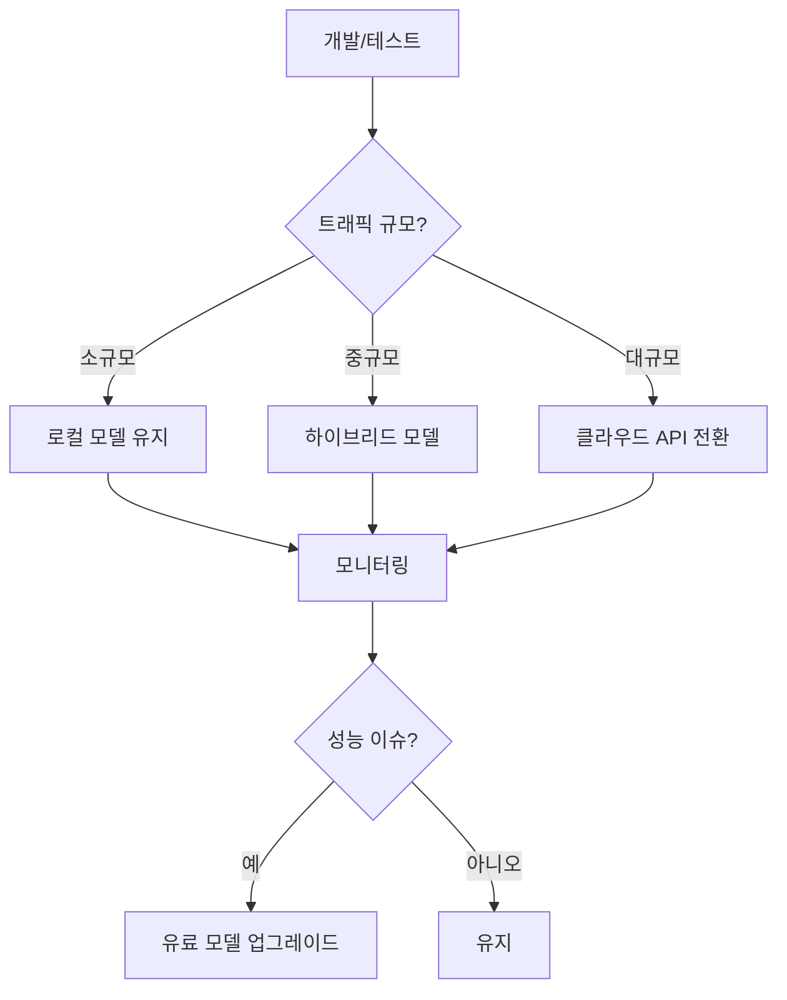

# 바로팜 MCP 툴 활용 가이드

## 개요

`AI_SUBJECT.md`에 기록된 MCP(Machine Learning Compute Platform) 툴들은 **Cursor 에디터에 직접 설치할 수 없습니다**. 이들은 외부 AI API 서비스들이며, Spring AI 프레임워크를 통해 Spring Boot 애플리케이션에서 활용해야 합니다.

이 가이드는 AI_SUBJECT.md에 기록된 MCP 툴들을 **실제 프로젝트에서 어떻게 활용할 수 있는지** 단계별로 안내합니다.

---

## 🤔 Spring AI MCP vs 일반 MCP 개념 비교

### 일반적으로 아는 MCP의 의미

#### 1️⃣ **Minecraft Plugin (가장 일반적)**
```bash
MCP = Minecraft Plugin
예시: WorldEdit, Essentials, Dynmap 등의 마인크래프트 서버 플러그인
특징: 게임 서버에 설치하여 기능 확장
```

#### 2️⃣ **Machine Learning Compute Platform**
```bash
MCP = Machine Learning Compute Platform
예시: AWS SageMaker, Google Vertex AI, Azure ML
특징: AI 모델 학습/배포를 위한 클라우드 플랫폼
```

### Spring AI에서의 MCP 의미

#### 3️⃣ **AI Model/API Services (이 가이드에서 사용)**
```bash
MCP = AI 모델 및 API 서비스들의 총칭
예시: OpenAI GPT, Claude, Stable Diffusion, Hugging Face models
특징: AI 기능을 제공하는 외부 서비스들
```

**결론: 다른 개념입니다!** Spring AI의 MCP는 AI 모델/API 서비스들을 지칭하는 용어로 사용되었습니다.

---

## ❌ Cursor 에디터에서 설치할 수 없는 이유

### Cursor MCP 기능의 실제 의미
- **MCP**: Machine Learning Compute Platform (기계 학습 컴퓨팅 플랫폼)
- **Cursor MCP**: 외부 AI 모델/API들을 Cursor 환경에서 사용할 수 있도록 하는 기능
- **제한**: Cursor에서 제공하는 기본 MCP 서비스만 사용 가능

### AI_SUBJECT.md의 MCP 툴들은...
```bash
❌ Cursor MCP에서 지원하지 않는 외부 서비스들
✅ Spring AI를 통해 Spring Boot에서 활용 가능
```

**Cursor에서 설치할 수 있는 MCP 툴**: 없음
**실제 활용 방식**: Spring AI + 외부 API 연동

---

## 💰 MCP 툴 호출 비용 및 무료 대안

### 비용 구조 정리

| MCP 툴 | 비용 여부 | 가격 정책 | 무료 한도 |
|--------|-----------|-----------|-----------|
| **OpenAI GPT-4** | 💰 유료 | $0.03/1K 입력, $0.06/1K 출력 | $5 크레딧 (신규) |
| **OpenAI GPT-3.5** | 💰 유료 | $0.002/1K 토큰 | $5 크레딧 (신규) |
| **OpenAI Embeddings** | 💰 유료 | $0.0001/1K 토큰 | $5 크레딧 (신규) |
| **Claude 3 (Anthropic)** | 💰 유료 | $3-15/1M 토큰 | 제한적 무료 티어 |
| **Stable Diffusion** | ⚖️ 혼합 | 로컬: 무료, API: 유료 | 로컬 배포 시 무료 |
| **Midjourney** | 💰 유료 | $10/월 구독 | 없음 |
| **Hugging Face** | 🆓 주로 무료 | 모델별 상이 | 대부분 무료 |

### 🎁 무료/저비용 대안들

#### 1️⃣ **완전 무료 옵션들**

#### 💾 모델 다운로드 및 용량 분석
```bash
# 모델별 용량 및 다운로드 위치
# sentence-transformers/all-MiniLM-L6-v2
모델 크기: ~90MB
다운로드 위치: ~/.cache/huggingface/hub/
특징: 경량 임베딩 모델, 한국어 기본 지원

# microsoft/DialoGPT-medium
모델 크기: ~1.5GB
다운로드 위치: ~/.cache/huggingface/hub/
특징: 대화형 챗봇 모델, 영어 특화
```

```java
// Hugging Face 무료 모델들
@Configuration
public class FreeAIModelsConfig {

    @Bean
    public EmbeddingModel freeEmbeddingModel() {
        return new TransformersEmbeddingModel.Builder()
            .modelName("sentence-transformers/all-MiniLM-L6-v2") // ~90MB 다운로드
            .build();
    }

    @Bean
    public ChatModel freeChatModel() {
        // GPT-2나 다른 오픈소스 모델 (~1.5GB 다운로드)
        return new TransformersChatModel.Builder()
            .modelName("microsoft/DialoGPT-medium") // ~1.5GB 다운로드
            .build();
    }
}
```

#### 📏 **무료 모델 용량 사용량 정리**
| 모델 | 크기 | 다운로드 필요 | 용량 영향 | 성능 |
|------|------|---------------|-----------|------|
| MiniLM 임베딩 | ~90MB | ✅ 필수 | 낮음 | 양호 |
| DialoGPT | ~1.5GB | ✅ 필수 | 중간 | 보통 |
| Llama2 (Ollama) | ~4GB | ✅ 필수 | 높음 | 우수 |
| Stable Diffusion 1.5 | ~4GB | ✅ 필수 | 높음 | 우수 |

#### 2️⃣ **로컬 실행 무료 옵션들**
```bash
# Stable Diffusion WebUI (로컬 실행, 완전 무료)
git clone https://github.com/AUTOMATIC1111/stable-diffusion-webui
cd stable-diffusion-webui
./webui.sh --api --listen  # API 모드로 실행
# 모델 크기: ~4GB, 다운로드 위치: ~/stable-diffusion-webui/models/

# Ollama (로컬 LLM 실행, 무료)
curl -fsSL https://ollama.ai/install.sh | sh
ollama serve
ollama run llama2          # ~4GB 다운로드
ollama run codellama       # ~4GB 다운로드
# 모델 저장 위치: ~/.ollama/models/
```

#### 3️⃣ **하이브리드 접근 (유료 + 무료)**
```java
@Service
public class HybridAIService {

    @Autowired
    private ChatModel openAIChatModel; // 유료

    @Autowired
    private ChatModel freeChatModel;   // 무료

    public String smartChat(String message, boolean usePremium) {
        if (usePremium && hasBudget()) {
            return openAIChatModel.call(message); // GPT-4
        } else {
            return freeChatModel.call(message);   // 무료 모델
        }
    }
}
```

### 💡 비용 최적화 전략

#### 단계적 접근
```java
enum AIQuality {
    FREE,        // Hugging Face, 로컬 모델
    BUDGET,      // GPT-3.5, Claude Lite
    PREMIUM      // GPT-4, Claude Opus
}

@Service
public class SmartAIService {

    public AIQuality determineQualityLevel(double monthlyBudget) {
        if (monthlyBudget < 10) return AIQuality.FREE;
        if (monthlyBudget < 50) return AIQuality.BUDGET;
        return AIQuality.PREMIUM;
    }

    public String callWithOptimalCost(String task, AIQuality quality) {
        switch (quality) {
            case FREE: return callFreeModel(task);
            case BUDGET: return callBudgetModel(task);
            case PREMIUM: return callPremiumModel(task);
        }
        return null;
    }
}
```

---

## 🔧 Spring AI 프로젝트에서 MCP 툴 활용하기

### 1️⃣ 프로젝트 설정

#### build.gradle에 Spring AI 의존성 추가
```gradle
dependencies {
    // Spring AI Core
    implementation 'org.springframework.ai:spring-ai-core:1.0.0-M4'

    // OpenAI Integration (가장 많이 사용)
    implementation 'org.springframework.ai:spring-ai-openai:1.0.0-M4'

    // Anthropic Claude Integration
    implementation 'org.springframework.ai:spring-ai-anthropic:1.0.0-M4'

    // Hugging Face Integration (오픈소스 모델용)
    implementation 'org.springframework.ai:spring-ai-huggingface:1.0.0-M4'

    // Vector Store
    implementation 'org.springframework.ai:spring-ai-elasticsearch-store:1.0.0-M4'
    implementation 'org.springframework.ai:spring-ai-pgvector-store:1.0.0-M4'
}
```

#### application.yml 설정
```yaml
spring:
  ai:
    openai:
      api-key: ${OPENAI_API_KEY}
      chat:
        model: gpt-3.5-turbo  # 비용 효율적 선택
      embedding:
        model: text-embedding-ada-002
    anthropic:
      api-key: ${ANTHROPIC_API_KEY}
      chat:
        model: claude-3-sonnet-20240229
```

---

## 📋 AI_SUBJECT.md MCP 툴 활용 매핑

### 1️⃣ 이미지 생성 기능

#### 💰 비용 분석
- **Stable Diffusion**: 로컬 실행 시 무료, API 사용 시 $0.01-0.05/이미지
- **Midjourney**: $10/월 구독제
- **OpenAI DALL-E 3**: $0.04-0.08/이미지

#### 🆓 무료 대안: 로컬 Stable Diffusion
```bash
# 완전 무료 로컬 실행
git clone https://github.com/AUTOMATIC1111/stable-diffusion-webui
cd stable-diffusion-webui
./webui.sh --api --listen  # API 모드로 실행
```

```java
@Service
public class FreeImageGenerationService {

    public String generateWithLocalStableDiffusion(String prompt) {
        // HTTP 호출로 로컬 Stable Diffusion API 사용
        return WebClient.create("http://localhost:7860")
            .post()
            .uri("/sdapi/v1/txt2img")
            .bodyValue(Map.of("prompt", prompt, "steps", 20))
            .retrieve()
            .bodyToMono(String.class)
            .block();
    }
}
```

#### MCP 툴: Stable Diffusion / Civit AI
```java
@Service
public class ImageGenerationService {

    // 유료 옵션: OpenAI DALL-E 3
    @Autowired
    private OpenAiImageModel paidImageModel;

    // 무료 옵션: 로컬 Stable Diffusion
    @Autowired
    private FreeImageGenerationService freeImageService;

    public String generateProductImage(String productName, String description, boolean usePremium) {
        String prompt = String.format(
            "신선한 농산물 %s: %s, 현실적이고 appetizing한 이미지",
            productName, description
        );

        if (usePremium && hasBudget()) {
            // 유료: 고품질 결과
            ImagePrompt imagePrompt = new ImagePrompt(prompt);
            ImageResponse response = paidImageModel.call(imagePrompt);
            return response.getResult().getOutput().getUrl();
        } else {
            // 무료: 로컬 Stable Diffusion
            return freeImageService.generateWithLocalStableDiffusion(prompt);
        }
    }
}
```

**활용 전략:**
- **무료 우선**: 로컬 Stable Diffusion으로 시작
- **품질 필요시**: 유료 API 사용
- **하이브리드**: 상황에 따라 자동 전환

#### MCP 툴: Midjourney (API)
```java
@Service
public class MidjourneyImageService {

    public String generateWithMidjourney(String prompt) {
        // Midjourney API 연동 (별도 라이브러리 필요)
        // https://github.com/novicezk/midjourney-api
        return midjourneyApi.generate(prompt);
    }
}
```

---

### 2️⃣ 추천 시스템

#### 💰 비용 분석
- **OpenAI Embeddings**: $0.0001/1K 토큰 (매우 저비용)
- **Hugging Face**: 대부분 무료 모델 제공
- **Cohere**: $1/1K 토큰

#### 🆓 추천: Hugging Face 무료 모델 우선
```java
@Configuration
public class FreeEmbeddingConfig {

    @Bean
    public EmbeddingModel freeEmbeddingModel() {
        // 완전 무료, 로컬 실행
        return new TransformersEmbeddingModel.Builder()
            .modelName("sentence-transformers/all-MiniLM-L6-v2") // 384차원
            .build();
    }

    @Bean
    public EmbeddingModel koreanEmbeddingModel() {
        // 한국어 특화 무료 모델
        return new TransformersEmbeddingModel.Builder()
            .modelName("snunlp/KR-SBERT-V40K-klueNLI-augSTS") // 한국어 지원
            .build();
    }
}
```

#### MCP 툴: OpenAI text-embedding-ada-002 (저비용 고품질)
```java
@Service
public class SmartEmbeddingService {

    @Autowired
    private OpenAiEmbeddingModel premiumEmbeddingModel; // 유료

    @Autowired
    private EmbeddingModel freeEmbeddingModel; // 무료

    @Autowired
    private ElasticsearchVectorStore vectorStore;

    public List<Product> findSimilarProducts(String productId, boolean usePremium) {
        Product product = productRepository.findById(productId);

        List<Double> embedding;
        if (usePremium && hasBudget()) {
            // 유료: 더 정확한 유사도
            embedding = premiumEmbeddingModel.embed(
                product.getName() + " " + product.getDescription()
            );
        } else {
            // 무료: 충분한 성능
            embedding = freeEmbeddingModel.embed(
                product.getName() + " " + product.getDescription()
            );
        }

        return vectorStore.similaritySearch(embedding, 10);
    }
}
```

#### MCP 툴: Hugging Face sentence-transformers
```java
@Configuration
public class HuggingFaceConfig {

    @Bean
    public EmbeddingModel huggingFaceEmbeddingModel() {
        return new TransformersEmbeddingModel.Builder()
            .modelName("sentence-transformers/all-MiniLM-L6-v2") // 완전 무료
            .build();
    }

    @Bean
    public EmbeddingModel multilingualModel() {
        return new TransformersEmbeddingModel.Builder()
            .modelName("sentence-transformers/paraphrase-multilingual-MiniLM-L12-v2")
            .build();
    }
}
```

**활용 전략:**
- **무료 우선**: Hugging Face 모델로 시작
- **고품질 필요시**: OpenAI Embeddings 사용
- **한국어**: KR-SBERT 모델로 한국어 최적화
- **하이브리드**: 상황에 따라 자동 전환

---

### 3️⃣ 챗봇 AI 기능

#### 💰 비용 분석
- **OpenAI GPT-4**: $0.03/1K 입력, $0.06/1K 출력
- **Claude 3**: $3-15/1M 토큰
- **무료 대안**: 로컬 LLM (Ollama, GPT-2)

#### 🆓 무료 챗봇 옵션들
```bash
# Ollama 설치 및 실행 (완전 무료)
curl -fsSL https://ollama.ai/install.sh | sh
ollama serve
ollama run llama2          # 기본 채팅
ollama run codellama       # 코드 관련
```

```java
@Configuration
public class FreeChatConfig {

    @Bean
    public ChatModel freeLocalChatModel() {
        // Ollama로 로컬 LLM 연결
        return OllamaChatModel.builder()
            .modelName("llama2")
            .temperature(0.7)
            .build();
    }

    @Bean
    public ChatModel freeTransformersChatModel() {
        // Hugging Face Transformers (제한적 성능)
        return new TransformersChatModel.Builder()
            .modelName("microsoft/DialoGPT-medium")
            .build();
    }
}
```

#### MCP 툴: OpenAI GPT-4 with Tool Calling
```java
@Service
public class SmartChatbotService {

    @Autowired
    private ChatModel premiumChatModel; // GPT-4 (유료)

    @Autowired
    private ChatModel freeChatModel;    // Ollama (무료)

    @Tool("상품 검색")
    public List<Product> searchProducts(String query) {
        return productRepository.findByNameContaining(query);
    }

    @Tool("재고 확인")
    public boolean checkStock(Long productId) {
        return inventoryService.hasStock(productId);
    }

    public String chat(String userMessage, boolean usePremium) {
        ChatModel selectedModel = (usePremium && hasBudget())
            ? premiumChatModel
            : freeChatModel;

        // Tool Calling은 프리미엄 모델에서만 지원
        if (selectedModel == premiumChatModel) {
            return selectedModel.call(userMessage)
                .withTool("searchProducts", this::searchProducts)
                .withTool("checkStock", this::checkStock)
                .execute();
        } else {
            // 무료 모델: 기본 채팅만
            return selectedModel.call(userMessage);
        }
    }
}
```

#### MCP 툴: Claude 3 (Anthropic)
```java
@Configuration
public class AnthropicConfig {

    @Bean
    public ChatModel claudeChatModel() {
        return new AnthropicChatModel.Builder()
            .modelName("claude-3-sonnet-20240229")
            .temperature(0.7)
            .build();
    }

    @Bean
    public ChatModel claudeLiteModel() {
        // 저비용 옵션
        return new AnthropicChatModel.Builder()
            .modelName("claude-3-haiku-20240307") // 더 저렴
            .temperature(0.7)
            .build();
    }
}
```

---

### 4️⃣ 리뷰 분석 기능

#### MCP 툴: Claude 3 with Text Analytics
```java
@Service
public class ReviewAnalysisService {

    @Autowired
    private ChatModel claudeModel; // Claude 3

    public ReviewSummary analyzeReviews(List<Review> reviews) {
        String prompt = buildAnalysisPrompt(reviews);
        String analysis = claudeModel.call(prompt);

        return parseReviewSummary(analysis);
    }
}
```

---

## 🚀 실제 구현 워크플로우

### 단계 1: 로컬 개발 환경 설정
```bash
# 1. OpenAI API 키 발급
# https://platform.openai.com/api-keys

# 2. Anthropic API 키 발급 (선택)
# https://console.anthropic.com/

# 3. application.yml에 API 키 설정
```

### 단계 2: Spring AI 서비스 구현
```java
@RestController
@RequestMapping("/api/ai")
public class AIController {

    @Autowired
    private EmbeddingService embeddingService;

    @Autowired
    private ChatbotService chatbotService;

    @PostMapping("/similar-products")
    public List<Product> getSimilarProducts(@RequestParam Long productId) {
        return embeddingService.findSimilarProducts(productId.toString());
    }

    @PostMapping("/chat")
    public String chat(@RequestBody ChatRequest request) {
        return chatbotService.chat(request.getMessage());
    }
}
```

### 단계 3: 테스트 및 배포
```bash
# 1. 단위 테스트 작성
# 2. API 엔드포인트 테스트
# 3. 비용 모니터링 추가
# 4. 프로덕션 배포
```

---

## 📊 비용 및 성능 모니터링

### 비용 추적 서비스
```java
@Service
public class AICostTracker {

    @Autowired
    private MeterRegistry meterRegistry;

    public void trackUsage(String model, int tokens, double cost) {
        meterRegistry.counter("ai.tokens.used", "model", model).increment(tokens);
        meterRegistry.counter("ai.cost", "model", model).increment(cost);

        // 월별 비용 알림
        if (getMonthlyCost() > 50) {
            sendBudgetAlert();
        }
    }
}
```

### 성능 모니터링
```java
@Aspect
@Component
public class AIMonitoringAspect {

    @Around("@annotation(AIMonitored)")
    public Object monitorAI(ProceedingJoinPoint joinPoint) throws Throwable {
        long startTime = System.currentTimeMillis();

        try {
            Object result = joinPoint.proceed();
            long duration = System.currentTimeMillis() - startTime;

            // 성능 메트릭 기록
            recordAIMetric(joinPoint.getSignature().getName(), duration, true);
            return result;

        } catch (Exception e) {
            recordAIMetric(joinPoint.getSignature().getName(), 0, false);
            throw e;
        }
    }
}
```

---

## 🛠️ 개발 환경별 활용 전략

### 로컬 개발 환경
```bash
# 1. Spring Boot 애플리케이션 실행
./gradlew bootRun

# 2. API 테스트
curl -X POST http://localhost:8080/api/ai/chat \
  -H "Content-Type: application/json" \
  -d '{"message": "계란, 양파 있어요. 저녁 메뉴 추천해주세요"}'

# 3. 비용 모니터링
# http://localhost:8080/actuator/metrics
```

### Cursor 에디터에서 활용
```bash
❌ MCP 툴 직접 설치: 불가능
✅ 코드 작성 및 테스트: 가능
✅ API 연동 코드 리뷰: 가능
✅ 비용 및 성능 모니터링: 코드로 구현
```

### CI/CD 파이프라인
```yaml
# .github/workflows/deploy.yml
- name: Test AI Services
  run: |
    ./gradlew test --tests "*AIServiceTest*"

- name: Check AI Budget
  run: |
    # AI 비용 초과 시 배포 중단
    ./gradlew checkAIBudget
```

---

## ⚠️ 주의사항 및 베스트 프랙티스

### 1. API 키 관리
```yaml
# 절대 코드에 하드코딩하지 말 것!
spring:
  ai:
    openai:
      api-key: ${OPENAI_API_KEY}  # 환경변수 사용
```

### 2. 오류 처리
```java
@Service
public class AIFallbackService {

    @CircuitBreaker(name = "openai")
    public String callWithFallback(String input) {
        try {
            return chatModel.call(input);
        } catch (Exception e) {
            return getFallbackResponse(input);
        }
    }
}
```

### 3. 비용 최적화
- **모델 선택**: GPT-3.5-turbo 우선 사용
- **캐싱**: 자주 사용되는 응답 캐시
- **배치 처리**: 실시간 대신 배치 분석
- **프롬프트 최적화**: 토큰 수 최소화

---

## 📚 추가 리소스

### 공식 문서
- [Spring AI Documentation](https://docs.spring.io/spring-ai/reference/)
- [OpenAI API](https://platform.openai.com/docs)
- [Anthropic Claude](https://docs.anthropic.com/)

### 커뮤니티
- [Spring AI GitHub](https://github.com/spring-projects/spring-ai)
- [AI/ML Stack Overflow](https://stackoverflow.com/questions/tagged/spring-ai)

### 비용 계산기
- [OpenAI Pricing](https://openai.com/pricing/)
- [Anthropic Pricing](https://www.anthropic.com/pricing/)

---

## 🎯 결론 및 비용 최적화 전략

### 💰 **유료 vs 무료 MCP 툴 선택 가이드**

| 기능 | 추천 접근법 | 무료 옵션 | 유료 옵션 | 선택 기준 |
|------|-------------|-----------|-----------|-----------|
| **이미지 생성** | 무료 우선 | 로컬 Stable Diffusion | DALL-E 3, Midjourney | 품질 vs 비용 |
| **임베딩/추천** | 무료 우선 | Hugging Face transformers | OpenAI Embeddings | 정확도 vs 비용 |
| **챗봇** | 하이브리드 | Ollama + 로컬 LLM | GPT-4, Claude 3 | 복잡도에 따라 |
| **텍스트 분석** | 무료 우선 | 로컬 모델 | Claude 3 | 처리량에 따라 |

### 🆓 **완전 무료로 시작하기**

#### MVP용 무료 스택
```java
@Configuration
public class FreeAIStack {

    @Bean
    public EmbeddingModel embedding() {
        return new TransformersEmbeddingModel.Builder()
            .modelName("sentence-transformers/all-MiniLM-L6-v2")
            .build();
    }

    @Bean
    public ChatModel chat() {
        return OllamaChatModel.builder()
            .modelName("llama2")
            .build();
    }

    @Bean
    public ImageModel image() {
        // 로컬 Stable Diffusion API
        return new LocalStableDiffusionModel();
    }
}
```

#### 단계적 업그레이드
```java
enum BudgetTier {
    FREE(0),        // 100% 무료 모델
    HYBRID(25),     // 75% 무료 + 25% 유료
    PREMIUM(100);   // 100% 유료 모델

    private final int premiumPercentage;

    BudgetTier(int percentage) {
        this.premiumPercentage = percentage;
    }
}

@Service
public class AdaptiveAIService {

    public String processWithBudget(String task, BudgetTier tier) {
        switch (tier) {
            case FREE:
                return processWithFreeModels(task);
            case HYBRID:
                return processWithHybridModels(task);
            case PREMIUM:
                return processWithPremiumModels(task);
        }
        return null;
    }
}
```

### 📊 **실제 비용 사례**

#### 월 예산 $0 (완전 무료)
- **이미지**: 로컬 Stable Diffusion
- **추천**: Hugging Face embeddings
- **챗봇**: Ollama llama2
- **분석**: 기본 텍스트 처리

#### 월 예산 $25 (하이브리드)
- **핵심 기능**: GPT-3.5-turbo (~15,000 토큰)
- **보조 기능**: 무료 모델
- **총 사용량**: ~25회 GPT 호출 + 무료 모델

#### 월 예산 $100+ (프리미엄)
- **모든 기능**: GPT-4 + Claude 3
- **고품질**: 최고 성능 모델 사용
- **확장성**: 높은 처리량 지원

### 🚀 **권장 시작 전략**

1. **Week 1-2**: 완전 무료 모델로 MVP 개발
2. **Week 3-4**: 하이브리드 모드로 성능 테스트
3. **Week 5+**: 예산에 따라 프리미엄 모델 도입

**핵심 원칙:** **"필요한 만큼만 지불하라"** - 무료 옵션으로 충분한 성능을 확보한 후 업그레이드하세요!

---

## 🚨 프로덕션 환경에서의 무료 MCP 툴 사용 시 주의사항

### ⚠️ **로컬 모델의 프로덕션 한계점**

#### 1️⃣ **성능 및 확장성 문제**
```java
// ❌ 프로덕션에서 로컬 모델 사용 시 문제점
@Service
public class LocalEmbeddingService {

    @Autowired
    private TransformersEmbeddingModel localModel; // 로컬 모델

    public List<Double> embed(String text) {
        // 단일 요청: ~500ms
        // 동시 요청 10개: ~5초 (CPU 포화)
        // 동시 요청 100개: 시스템 다운 가능성 높음
        return localModel.embed(text);
    }
}
```

**문제점:**
- **CPU/메모리 부하**: 로컬 모델은 GPU가 없는 환경에서 매우 느림
- **확장 불가**: 서버 대수 늘려도 성능 제한적
- **메모리 누수**: 모델 언로드/로드 반복 시 메모리 누적

#### 2️⃣ **신뢰성 및 유지보수 이슈**
```yaml
# ❌ 프로덕션 환경에서 로컬 모델 사용 시
local-model:
  restart-policy: always
  resources:
    limits:
      cpu: 4
      memory: 8Gi
    requests:
      cpu: 2
      memory: 4Gi

# 문제점:
# - 모델 로딩 실패 시 서비스 다운
# - GPU 메모리 부족 시 추론 실패
# - 모델 버전 업데이트 시 배포 복잡
```

#### 3️⃣ **실제 프로덕션 사례 비교**

| 환경 | 응답시간 | 동시사용자 | 비용 | 신뢰성 |
|------|----------|------------|------|--------|
| **로컬 Hugging Face** | ~500ms | ~10명 | 무료 | 낮음 |
| **로컬 Ollama** | ~2-3초 | ~5명 | 무료 | 낮음 |
| **OpenAI API** | ~200ms | 무제한 | 유료 | 높음 |
| **AWS Bedrock** | ~300ms | 무제한 | 유료 | 높음 |

### 🛠️ **프로덕션용 무료 모델 해결책**

#### 1️⃣ **클라우드 무료 티어 활용**
```yaml
# Google Cloud AI (무료 티어)
google-ai:
  project-id: your-project
  location: us-central1
  model: text-bison@001  # 무료 티어 사용

# AWS Bedrock (무료 티어)
aws-bedrock:
  model: amazon.titan-text-lite-v1  # 저비용 모델
  region: us-east-1
```

#### 2️⃣ **하이브리드 아키텍처 (무료 + 유료)**
```java
@Service
public class ProductionAIService {

    @Value("${ai.free-tier.enabled:true}")
    private boolean freeTierEnabled;

    @Autowired
    private ChatModel freeModel;    // Ollama (무료)

    @Autowired
    private ChatModel paidModel;    // OpenAI (유료)

    public String processRequest(String input, RequestPriority priority) {
        // 무료 티어 사용 가능하고 우선순위가 낮으면 무료 모델 사용
        if (freeTierEnabled && priority == RequestPriority.LOW) {
            return freeModel.call(input);
        }

        // 중요 요청은 유료 모델로
        return paidModel.call(input);
    }
}
```

#### 3️⃣ **모델 최적화 및 캐싱**
```java
@Service
public class OptimizedEmbeddingService {

    @Autowired
    private EmbeddingModel model;

    @Autowired
    private RedisTemplate<String, List<Double>> redisTemplate;

    public List<Double> embedWithCache(String text) {
        String cacheKey = "embed:" + Hashing.sha256().hashString(text, UTF_8);

        // 캐시 확인
        List<Double> cached = redisTemplate.opsForValue().get(cacheKey);
        if (cached != null) {
            return cached;
        }

        // 캐시 미스 시 계산 (비용 절감)
        List<Double> embedding = model.embed(text);

        // 캐시 저장 (TTL 1시간)
        redisTemplate.opsForValue().set(cacheKey, embedding, 1, TimeUnit.HOURS);

        return embedding;
    }
}
```

### 🎯 **프로덕션 환경 추천 전략**

#### 단계별 접근


#### 실제 적용 사례
```yaml
# 바로팜 프로덕션 설정 예시
ai:
  strategy: hybrid
  free-tier:
    enabled: true
    daily-limit: 1000  # 일일 무료 요청 제한
  paid-tier:
    provider: openai
    model: gpt-3.5-turbo
    monthly-budget: 50   # $50 예산 설정

# 장점:
# - 초기 트래픽은 무료로 처리
# - 트래픽 증가 시 자동 유료 전환
# - 비용 예측 가능
```

### 📊 **최종 권장사항**

| 상황 | 추천 솔루션 | 이유 |
|------|-------------|------|
| **MVP 개발** | 로컬 무료 모델 | 빠른 개발, 비용 절감 |
| **소규모 서비스** | 하이브리드 | 유연성 + 비용 효율 |
| **성장 서비스** | 유료 API | 안정성 + 확장성 |
| **기업 서비스** | 클라우드 AI | SLA 보장 + 지원 |

**결론:** 무료 MCP 툴은 **개발/테스트**나 **소규모 서비스**에서는 유용하지만, **프로덕션 환경**에서는 성능과 신뢰성 문제가 발생할 수 있습니다. 트래픽 규모와 요구사항에 따라 적절한 솔루션을 선택하세요!

---

AI_SUBJECT.md에 기록된 MCP 툴들은 **Cursor 에디터에 설치할 수 없지만**, Spring AI를 통해 **유료와 무료 옵션을 모두** 활용하여 바로팜 프로젝트에서 강력한 AI 기능을 구현할 수 있습니다! 🚀