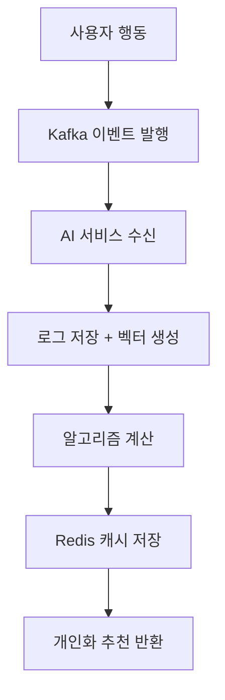

# 바로팜 AI 시스템 개요

## 🎯 시스템 목적

이 모듈은 **"로그 기반 개인화 추천 + 레시피 추천 + (보조) 검색/챗봇"**이 핵심 역할로,
사용자의 **장바구니, 검색, 주문 내역**을 분석하여 개인화된 상품 추천을 제공하고,
**레시피 추천, 챗봇, 의미 검색** 기능을 통해 농산물 쇼핑 경험을 혁신합니다.

**추천 대상은 오직 로그인 사용자 (userId 중심)**이며,
Kafka 이벤트/ES/LLM을 활용해 **읽기 전용 뷰와 추천 결과**를 만들어냅니다.

## 🏗️ 시스템 아키텍처

```
[Frontend/Buyer] ──┐
                   ├── [API Gateway]
                   │
[baro-support] ────┼── [baro-ai] ◄── Kafka 이벤트 스트림
                   │
[baro-buyer] ─────┘
```

## 🚀 핵심 기능

### 1. **로그 기반 개인화 추천** (핵심)
- 사용자 행동 로그(userId 중심) → 취향 벡터 생성 → 상품 벡터 매칭
- **장바구니, 검색, 주문 내역** 기반 실시간 추천
- **Redis 캐싱**으로 고성능 응답 보장

### 2. **레시피 추천** (핵심)
- **장바구니 상품 조합**으로 레시피 제안 (LLM 활용)
- **부족 재료 자동 검색** 및 상품 추천 (Elasticsearch 연동)
- **냉장고 재료 입력**으로도 레시피 생성 가능

### 3. **서비스 챗봇** (보조)
- **RAG 기반** 정책 질문 답변
- **서비스 정책 문서** 기반 정확한 정보 제공
- **Tool Calling**으로 실시간 정보 조회

### 4. **의미 검색** (보조)
- **의도 해석** → **벡터 검색** → **점수 합산**
- **다국어 지원** 및 **오탈자 허용**
- **초성 검색**으로 사용자 편의성 향상

## 🏛️ 패키지 구조

```
com.barofarm.ai/
├── common/          # 기술 공유 레이어 (Exception/Response/BaseEntity)
├── config/          # 인프라 설정 (Kafka/ES/OpenAI/JPA)
├── event/           # Kafka 이벤트 수신 (입력 포트)
├── log/             # 사용자 행동 로그 (RDB, 개인화 원자료)
├── embedding/       # 벡터/임베딩 관리 (User/Product/Experience/Policy)
├── search/          # AI 관점 검색 뷰 (ES 검색 + 자동완성)
├── recommend/       # 추천 도메인 (개인화/레시피/유사 상품)
├── presentation/    # 외부 API (REST Controller)
└── AiApplication.java
```

## 🛠️ 기술 스택

| 카테고리 | 기술 | 목적 |
|---------|------|------|
| **AI/ML** | OpenAI GPT-4/Embeddings, Ollama | LLM 및 임베딩 |
| **벡터 검색** | Elasticsearch | 상품/사용자 벡터 저장 및 검색 |
| **캐싱** | Redis | 추천 결과 및 임베딩 캐시 |
| **메시징** | Kafka | 이벤트 기반 데이터 동기화 |
| **프레임워크** | Spring AI, Spring Boot 3 | AI 통합 및 마이크로서비스 |
| **데이터베이스** | MySQL | 사용자 행동 로그 저장 |

## 📊 데이터 흐름



## 🎯 주요 특징

- **로그 중심 아키텍처**: 사용자 행동 로그를 기반으로 한 추천 엔진
- **이벤트 드리븐**: Kafka 기반 실시간 데이터 처리
- **벡터 기반 검색**: Elasticsearch를 활용한 의미 검색
- **하이브리드 캐싱**: Redis를 통한 고성능 응답
- **모듈 분리**: 각 레이어의 책임 명확한 분리
- **확장성**: 마이크로서비스 기반 아키텍처
