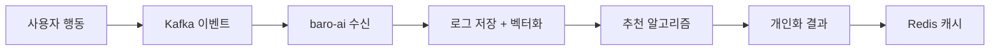

# 바로팜 AI 모듈 (baro-ai)

> **로그 기반 개인화 추천 엔진** - 사용자의 행동 패턴을 학습하여 맞춤 상품과 레시피를 추천하는 AI 서비스

## 📋 목차

- [시스템 개요](#-시스템-개요)
- [핵심 기능](#-핵심-기능)
- [아키텍처 설계](#-아키텍처-설계)
- [폴더 구조 가이드라인](#-폴더-구조-가이드라인)
- [기술 스택](#-기술-스택)
- [개발 시작하기](#-개발-시작하기)

---

## 🎯 시스템 개요

`baro-ai` 모듈은 **사용자 행동 기반 개인화 추천 시스템**으로, 다음과 같은 특징을 가집니다:

### 📈 핵심 가치

- **데이터 중심**: 실시간으로 수집되는 사용자 행동 로그를 기반으로 한 추천
- **벡터 기반**: Elasticsearch를 활용한 벡터 유사도 계산 (개인화 추천 등)
- **이벤트 드리븐**: Kafka를 통한 실시간 데이터 처리
- **확장성**: 헥사고날 아키텍처 기반의 모듈화된 설계

### 🎪 주요 역할

1. **개인화 상품 추천**: 사용자의 검색/장바구니/주문 패턴 분석 → 맞춤 상품 추천
2. **사용자 프로필 임베딩**: 로그 기반 가중치 적용 벡터 생성 (UserProfileEmbeddingService)
3. **상품 임베딩**: 상품명 기반 벡터 생성 (ProductEmbeddingService)
4. **레시피 추천**: 장바구니 상품을 기반으로 한 요리법 제안 및 부족 재료 추천
5. **비슷한 상품 추천**: 상품 상세 페이지에서 벡터 유사도 기반 유사 상품 추천
6. **서비스 챗봇**: 정책 기반 질문 답변 (RAG)

### 🔄 데이터 플로우



---

## 🚀 핵심 기능

### 1. **로그 기반 개인화 추천** ⭐⭐⭐

**사용자 행동 로그 → 가중치 적용 텍스트 → 임베딩 벡터 → 상품 매칭** 방식의 추천 엔진

- **입력**: 검색/장바구니/주문 로그 (각 타입별 최대 5개씩, 총 최대 15개)
- **처리**: 
  - 수량 × 이벤트 타입 × 시간 가중치 적용
  - 대표 텍스트 생성 후 OpenAI 임베딩
  - 1536차원 벡터로 사용자 취향 표현
- **출력**: Top-K 개인화 상품 리스트 (상품 ID, 이름, 카테고리, 가격 포함)
- **품질 보장**: 최소 3개 이상 로그 필요
- **API**: 
  - `GET /api/v1/recommendations/personalized/{userId}` - 일반 추천
  - `GET /api/v1/recommendations/personalized/{userId}/with-score` - 검증용 (유사도 점수 포함)

### 2. **레시피 추천** ✅ 구현 완료

**장바구니 상품 → LLM 분석 → 레시피 + 부족 재료 추천**

- **입력**: 장바구니 상품 목록 (실제 상품명)
- **처리**:
  - `ProductNameNormalizer`: 상품명에서 재료 추출 (LLM)
  - `RecipePromptService`: 보유 재료로 레시피 생성 (LLM)
  - `IngredientProcessingUtil`: 재료 정규화 및 비교
- **출력**: 레시피 정보 + 부족 재료 + 추천 상품
- **API**: `POST /api/v1/recommendations/recipes/test` (테스트용)

### 3. **비슷한 상품 추천** ✅ 구현 완료

**상품 상세 페이지에서 유사한 상품 추천 (벡터 유사도 기반)**

- **입력**: 기준 상품 ID
- **처리**:
  - 기준 상품의 임베딩 벡터 조회
  - `VectorProductSearchService`: 코사인 유사도를 이용한 벡터 검색
  - 자기 자신 제외 및 판매 중인 상품만 필터링
- **출력**: 유사도가 높은 상품 목록 (Top-K)
- **API**: `GET /api/v1/recommendations/similar/{productId}?topK=3`


### 4. **서비스 챗봇** ⚠️ 미구현

> 현재 미구현 상태입니다. `ChatbotController`는 빈 클래스입니다.

**정책 문서 기반 RAG**로 정확한 답변 제공

- **RAG 구현**: 정책 문서 벡터화 + 유사도 검색
- **안전성**: 정책 외 질문 거부
- **실시간성**: 최신 정책 반영

### 5. **데이터 생성 도구** 🛠️

개발 및 테스트 편의를 위한 데이터 생성 API

- **상품 데이터 증폭**: SQL 파일 기반 LLM 자동 증폭
- **더미 로그 생성**: 테스트용 사용자 행동 로그 생성
- **프로필 임베딩 생성**: 테스트용 사용자 프로필 임베딩 생성

---

## 🏛️ 아키텍처 설계

### DDD 계층형 아키텍처 (DDD Layered Architecture)

`baro-ai` 모듈은 도메인 주도 설계(DDD)의 핵심 사상을 반영한 **계층형 아키텍처**를 지향합니다. 이 구조는 소프트웨어를 논리적인 세 개의 계층으로 분리하여 각 계층이 명확한 책임을 갖도록 합니다.

```text
┌─────────────────────────────────────────┐
│        Infrastructure Layer             │  layered-architecture
│ (Web, Persistence, Messaging, External APIs) │
└───────────────────┬─────────────────────┘
                    │
                    ▼
┌─────────────────────────────────────────┐
│          Application Layer              │
│ (UseCases, DTOs, Transaction Control)   │
└───────────────────┬─────────────────────┘
                    │
                    ▼
┌─────────────────────────────────────────┐
│             Domain Layer                  │
│   (Entities, Value Objects, Repositories)   │
└─────────────────────────────────────────┘
```

#### 핵심 계층과 원칙

1.  **Domain Layer (도메인 계층)**
    *   **역할**: 애플리케이션의 핵심 비즈니스 로직과 규칙을 포함합니다. `Entity`, `Value Object`, `Repository Interface` 등이 여기에 속합니다.
    *   **원칙**: 가장 안쪽에 위치하며, 다른 어떤 계층에도 의존하지 않는 순수한 영역입니다.

2.  **Application Layer (애플리케이션 계층)**
    *   **역할**: 도메인 계층의 객체들을 사용하여 실제 유스케이스(Use Case)를 구현합니다. 트랜잭션 처리, DTO 변환 등 응용 로직을 담당합니다.
    *   **원칙**: 도메인 계층에만 의존합니다. 인프라 계층의 구체적인 기술을 알지 못합니다.

3.  **Infrastructure Layer (인프라스트럭처 계층)**
    *   **역할**: 외부 세계와의 통신과 기술적인 부분을 처리합니다. REST 컨트롤러, 데이터베이스 연동(Repository 구현체), 메시징(Kafka), 외부 API 호출 등이 여기에 속합니다.
    *   **원칙**: 애플리케이션 계층을 호출하여 유스케이스를 실행하거나, 도메인 계층의 인터페이스를 구현합니다.

#### 의존성 규칙
오직 바깥쪽 계층에서 안쪽 계층으로만 의존성이 흐릅니다. (`Infrastructure` → `Application` → `Domain`) 이를 통해 비즈니스 로직(Domain)이 외부 기술 변화로부터 완벽하게 보호됩니다.

---

## 📁 폴더 구조 가이드라인

### DDD 계층형 아키텍처 기반 구조

`recommend`, `search`, `chatbot` 등 혼재된 도메인 관심사를 명확히 분리하고, 계층별 역할을 명확히 하기 위해 다음과 같은 구조를 제안합니다.

```text
src/main/java/com/barofarm/ai/
├── 📁 domain/               # 🏛️ 도메인 계층: 순수한 비즈니스 로직과 데이터
│   ├── model/              # 도메인 모델 (엔티티, VO)
│   │   ├── recommendation/
│   │   ├── search/
│   │   └── chatbot/
│   ├── repository/         # 리포지토리 인터페이스 (영속성 추상화)
│   │   ├── RecommendationRepository.java
│   │   └── SearchLogRepository.java
│   └── service/            # 도메인 서비스 (선택적)
│
├── 📁 application/          # 🚀 애플리케이션 계층: 유스케이스 구현
│   ├── recommendation/
│   │   ├── RecommendationService.java
│   │   └── dto/
│   ├── search/
│   │   ├── SearchService.java
│   │   └── dto/
│   └── chatbot/
│       ├── ChatbotService.java
│       └── dto/
│
├── 📁 infrastructure/       # 🔧 인프라스트럭처 계층: 외부 기술 연동
│   ├── web/                # REST 컨트롤러
│   │   ├── RecommendationController.java
│   │   └── SearchController.java
│   ├── persistence/        # 데이터 영속성 구현체
│   │   ├── jpa/
│   │   └── elasticsearch/
│   ├── messaging/          # 메시징 관련 (Kafka Consumers/Producers)
│   │   └── consumer/
│   ├── external/           # 외부 API 클라이언트 (OpenAI 등)
│   │   └── openai/
│   └── config/             # Spring, Kafka 등 각종 설정
│
└── 📁 common/                # 🛠️ 공통 유틸리티 (계층에 속하지 않음)
    ├── exception/
    └── response/
```

### 구조 설계 원칙

1.  **계층 분리 원칙**: 각 클래스는 `domain`, `application`, `infrastructure` 중 하나의 계층에만 속해야 합니다.
2.  **명확한 책임**: `domain`은 비즈니스 규칙, `application`은 유스케이스 흐름, `infrastructure`는 기술 구현을 책임집니다.
3.  **단방향 의존성**: `infrastructure`는 `application`을, `application`은 `domain`을 의존할 수 있지만, 그 반대는 절대 불가합니다.

### 현재 구조 (As-Is)

현재 baro-ai 모듈은 다음과 같은 구조를 가지고 있습니다:

```text
src/main/java/com/barofarm/ai/
├── presentation/              # REST 컨트롤러
│   ├── RecommendationController.java
│   ├── ChatbotController.java
│   └── ...
├── search/
│   ├── presentation/         # 검색 관련 컨트롤러
│   ├── application/          # 검색 서비스 로직
│   ├── domain/               # 검색 도메인 모델
│   └── infrastructure/       # Elasticsearch 리포지토리
├── recommend/
│   ├── application/           # 추천 서비스 (PersonalizedRecommendService, RecipeRecommendService)
│   │   ├── config/           # 추천 설정 (RecommendProperties)
│   │   └── dto/              # 추천 응답 DTO
│   ├── domain/               # 도메인 모델 (CandidateRecipePlan, IngredientProcessingUtil, OwnedIngredient, RecipeCandidates)
│   ├── infrastructure/       # 외부 연동
│   │   ├── client/           # Cart API 클라이언트
│   │   └── llm/              # LLM 서비스 (ProductNameNormalizer, RecipePromptService)
│   ├── presentation/          # 추천 컨트롤러 (RecommendationController)
│   └── exception/            # 추천 에러 코드 (RecommendErrorCode)
├── embedding/
│   ├── application/           # 임베딩 서비스
│   ├── domain/               # 임베딩 도메인 모델
│   ├── infrastructure/        # Elasticsearch 리포지토리
│   │   └── elasticsearch/
│   └── exception/            # 임베딩 에러 코드
├── log/
│   ├── domain/               # 로그 도메인 모델
│   ├── infrastructure/       # Elasticsearch 리포지토리
│   │   └── elasticsearch/
│   ├── application/          # 로그 서비스
│   └── exception/            # 로그 에러 코드
├── event/
│   ├── consumer/              # Kafka 이벤트 컨슈머
│   └── model/                # 이벤트 모델
├── datagen/                  # 데이터 생성 도구
├── config/                   # Spring 설정
└── common/                   # 공통 유틸리티
```

### 목표 구조 (To-Be)

향후 DDD 계층형 아키텍처로 리팩토링할 계획입니다:

| 현재 구조 (As-Is) | 목표 구조 (To-Be) | 설명 |
| :--- | :--- | :--- |
| `recommend/presentation` | `recommend/presentation` | REST 컨트롤러 (완료) |
| `recommend/application` | `recommend/application` | 서비스 로직 (완료) |
| `recommend/domain` | `recommend/domain` | 도메인 모델 (완료) |
| `recommend/infrastructure` | `recommend/infrastructure` | 외부 연동 (완료) |
| `recommend/application/dto` | `recommend/application/dto` | DTO (완료) |
| `recommend/exception` | `recommend/exception` | 에러 코드 (완료) |
| `search/presentation` | `search/presentation` | REST 컨트롤러 (유지) |
| `search/application` | `search/application` | 유스케이스 서비스 (유지) |
| `search/domain` | `search/domain` | 도메인 모델 (유지) |
| `search/infrastructure` | `search/infrastructure` | 리포지토리 구현체 (유지) |
| `log/domain` | `log/domain` | 도메인 모델 (유지) |
| `log/infrastructure/elasticsearch` | `log/infrastructure/elasticsearch` | 리포지토리 구현체 (완료) |
| `log/application` | `log/application` | 로그 서비스 (유지) |
| `log/exception` | `log/exception` | 에러 코드 (완료) |
| `event` | `event` | Kafka 관련 로직 (공통 유지) |
| `embedding/application` | `embedding/application` | 임베딩 서비스 (완료) |
| `embedding/domain` | `embedding/domain` | 도메인 모델 (유지) |
| `embedding/infrastructure/elasticsearch` | `embedding/infrastructure/elasticsearch` | 리포지토리 구현체 (완료) |
| `embedding/exception` | `embedding/exception` | 에러 코드 (완료) |
| `datagen/application` | `datagen/application` | 데이터 생성 서비스 (유지) |
| `datagen/application/dto` | `datagen/application/dto` | DTO (완료) |
| `datagen/exception` | `datagen/exception` | 에러 코드 (완료) |
| `chat/application` | `chat/application` | 챗봇 서비스 (완료) |
| `chat/presentation` | `chat/presentation` | 챗봇 컨트롤러 (유지) |
| `chat/exception` | `chat/exception` | 에러 코드 (완료) |
| `config` | `config` | Spring, 모듈 설정 (유지) |
| `common` | `common` | 공통 유틸리티 (유지) |

> **참고**: DDD 계층형 아키텍처 기반 리팩토링이 완료되었습니다. 각 도메인은 `application`, `domain`, `infrastructure`, `presentation`, `exception` 계층으로 구성되어 있습니다.


---

## 🛠️ 기술 스택

### AI/ML
- **OpenAI GPT-4**: 텍스트 생성 (레시피 추천, 챗봇)
- **OpenAI Embedding**: 벡터 생성 (`text-embedding-3-small`, 1536차원)
- **Spring AI**: AI 통합 프레임워크
- **LangChain**: RAG 구현 (향후)

### 데이터/검색
- **Elasticsearch**: 벡터 검색 및 로그 저장
- **Redis**: 고성능 캐싱
- **Spring Data JPA**: 관계형 데이터

### 메시징/이벤트
- **Apache Kafka**: 이벤트 스트림 처리
- **Spring Kafka**: 메시징 통합

### 인프라
- **Spring Boot 3**: 마이크로서비스 프레임워크
- **Spring Cloud**: 클라우드 네이티브 기능
- **Docker/K8s**: 컨테이너화 및 오케스트레이션

### 모니터링
- **Spring Actuator**: 애플리케이션 메트릭
- **Micrometer**: 메트릭 수집
- **ELK Stack**: 로그 수집 및 분석

---

## 🚀 개발 시작하기

### 환경 요구사항

```text
- Java 17+
- Gradle 7.6+
- Elasticsearch 8.x
- Redis 7.x
- Kafka 3.x
- Docker & Docker Compose
```

### 로컬 개발 환경 설정

```bash
# 1. 의존성 설치
./gradlew build

# 2. 인프라 서비스 실행
docker-compose -f docker-compose.data.yml up -d

# 3. 애플리케이션 실행
./gradlew bootRun

# 4. API 테스트
curl http://localhost:8092/api/v1/recommendations/personalized/1
```

### 개발 워크플로우

1. **도메인 모델링**: 도메인 계층부터 시작
2. **유스케이스 정의**: 애플리케이션 서비스 작성
3. **포트 설계**: 인터페이스 기반 설계
4. **어댑터 구현**: 외부 연동 구현
5. **테스트 작성**: TDD 방식 권장

### 코드 품질

- **테스트 커버리지**: 80% 이상 목표
- **코드 리뷰**: 모든 PR에 필수
- **아키텍처 준수**: 헥사고날 패턴 준수 검증
- **성능 모니터링**: 메트릭 기반 최적화

---

## 📚 참고 문서

- [**기능 명세**](FEATURES.md) - 각 기능의 상세 설명
- [**구현 가이드**](IMPLEMENTATION.md) - 코드 예시 및 설정
- [**임베딩 예시**](EMBEDDING_EXAMPLE.md) - 사용자 프로필 임베딩 생성 예시
- [**미래 작업**](FUTURE_WORKS.md) - 추후 구현 예정 사항

---

## 🤝 기여하기

1. **이슈 생성**: 개선사항이나 버그 리포트
2. **브랜치 생성**: `feature/` 또는 `fix/` 접두사 사용
3. **PR 제출**: 코드 리뷰 요청
4. **테스트 확인**: CI/CD 파이프라인 통과 확인

### 코드 리뷰 체크리스트

- [ ] 헥사고날 아키텍처 패턴 준수
- [ ] 도메인 로직이 domain 패키지에 위치
- [ ] 인터페이스(포트)를 통한 의존성 역전
- [ ] 단위 테스트 및 통합 테스트 작성
- [ ] 코드 커버리지 80% 이상 유지

---

*이 문서는 지속적으로 업데이트됩니다. 최신 정보는 팀 문서를 참고해주세요.*