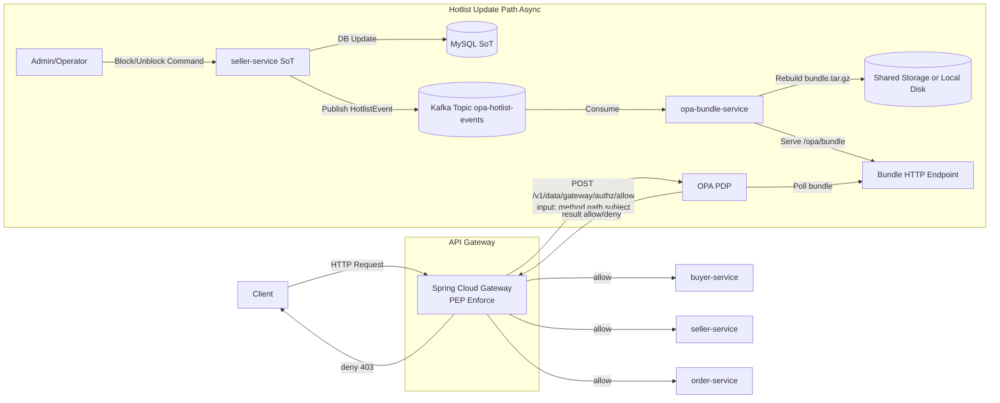
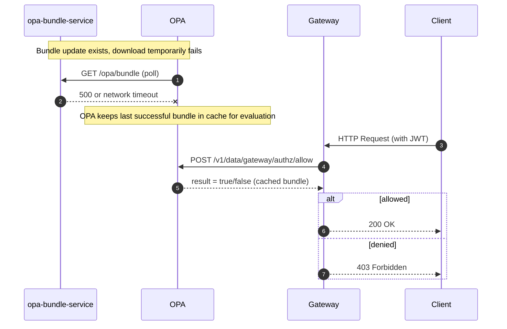
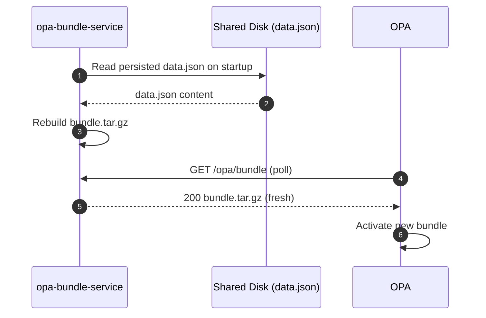
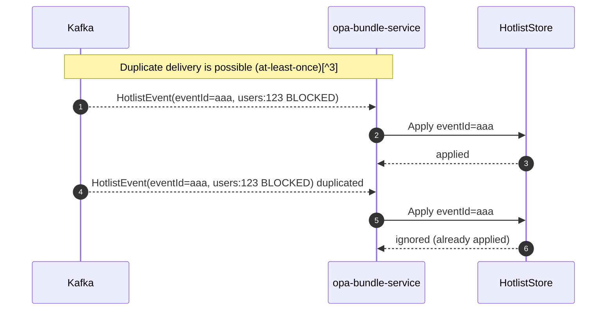
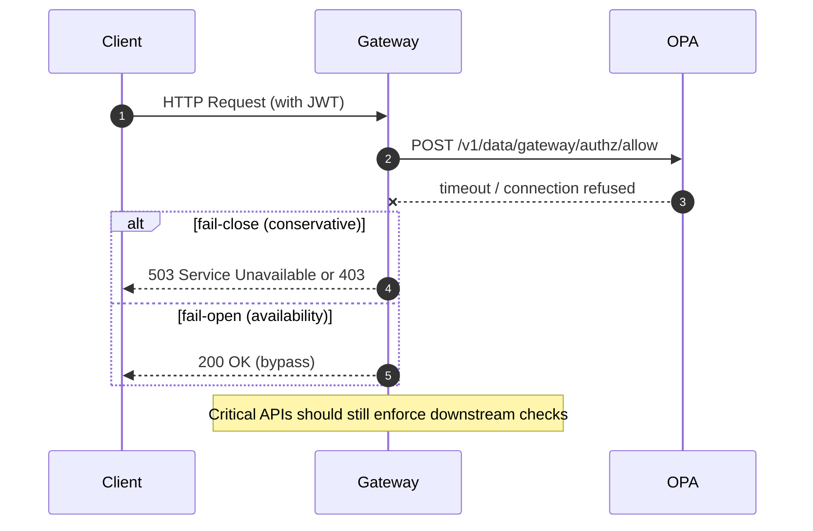

# OPA Architecture

## Overview
This document describes how the gateway builds OPA inputs, how policies and data are bundled,
and how hotlist updates flow from services to OPA.[^1]

## Decision API Input Schema
The gateway posts a fixed input schema to the OPA Decision API (`/v1/data/gateway/authz/allow`).[^2]

Example input payload:
```json
{
  "input": {
    "schema_version": 1,
    "request": {
      "method": "GET",
      "path": "/api/orders/123"
    },
    "subject": {
      "id": "user-123",
      "email": "user@example.com",
      "roles": ["CUSTOMER"],
      "user_status": "ACTIVE",
      "seller_status": "UNKNOWN",
      "flags": []
    }
  }
}
```

## Gateway + OPA + Hotlist Flow


## Scenarios (E-H)








[^1]: Bundle polling settings live in `baro-cloud/opa/opa-config.yaml`.
[^2]: Input is built in `baro-cloud/gateway/src/main/java/com/barofarm/gateway/filter/OpaAuthorizationGatewayFilterFactory.java`.
[^3]: `eventId` is optional but recommended for idempotent processing.
